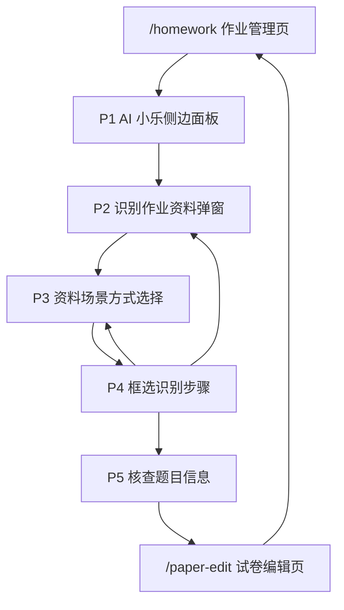
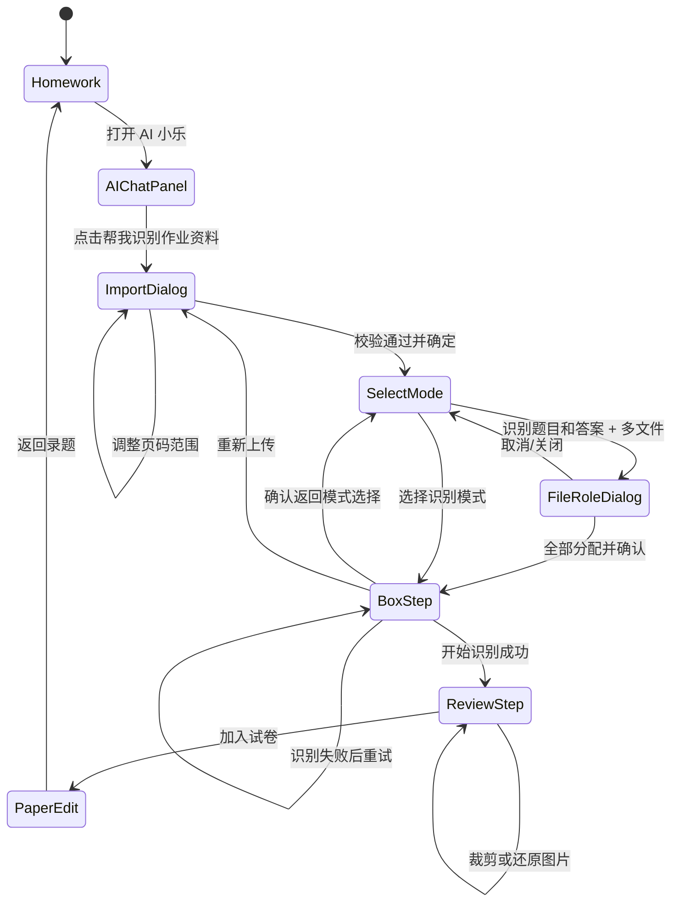

# 识别作业资料流程总 PRD（AI 阅读版）

## 文档说明

本文档整合以下 5 份单页面 PRD，不做简单拼接，而是按系统模块、页面关系、操作路径、全局规则和来源索引重新组织，供 AI 或后续开发快速理解“识别作业资料”完整业务链路。

- `产品文档/prd/01-ai-chat-panel.prd.md`
- `产品文档/prd/02-import-document-dialog.prd.md`
- `产品文档/prd/03-upload-question-dialog-select-mode.prd.md`
- `产品文档/prd/04-box-recognition-step.prd.md`
- `产品文档/prd/05-question-answer-review-step.prd.md`

项目背景信息由业务方后续补充；本文档只沉淀当前代码、需求注册表和已确认页面决策中可以确认的范围。

## 第一部分：系统总览

### 1.1 项目背景

本项目为OCR项目专项优化，项目的需求源于之前已实现的效果存在：上传效率低、超限场景体验差、答案匹配成本高、异常流程易中断四大痛点。

### 1.2 系统目标

通过流程和交互的优化，解决上传效率低，超限场景体验差、答案匹配成本高、异常流程易中断四大痛点，以支撑 OCR 组卷、AI 批改等核心业务的规模化落地。

当前文档覆盖从 AI 小乐入口到试卷编辑页交接前后的主要链路：

1. 教师在作业管理页打开 AI 小乐。
2. 教师通过 AI 小乐发起“识别作业资料”任务。
3. 教师在识别作业资料弹窗中选择本地文件或资源库资料，并确认学段学科、页码范围。
4. 教师在上传录题弹窗中选择识别方式。
5. 教师在资料上检查或手动画框，并启动识别。
6. 教师核查题目信息、答案解析、子题结构和图片裁剪结果。
7. 教师点击“加入试卷”，进入试卷编辑页继续编辑。

### 1.3 模块划分

| 模块编号 | 模块名称 | 包含页面/流程 | 主要职责 | 来源 PRD |
| --- | --- | --- | --- | --- |
| M1 | AI 小乐任务入口 | AI 小乐侧边面板组件 | 提供识别作业资料快捷入口，限制当前版本只通过快捷按钮发起任务 | `ai-chat-panel.prd.md` |
| M2 | 资料导入与范围校验 | 识别作业资料弹窗 | 选择本地资料或资源库资料，完成格式、页数、范围、学段学科和提交校验 | `import-document-dialog.prd.md` |
| M3 | 上传录题流程 | 资料场景方式选择、框选识别、核查题目信息 | 确定识别模式，完成资料框选、题目识别、答案匹配、题目核查和加入试卷 | `upload-question-dialog-select-mode.prd.md`、`box-recognition-step.prd.md`、`question-answer-review-step.prd.md` |
| M4 | 下游试卷编辑交接 | `/paper-edit` 试卷编辑页 | 接收题目、答案、解析、子题、图片和学科信息；支持从试卷编辑页返回录题 | 来源于核查题目信息 PRD 的下游流程 |

### 1.4 页面索引

| 页面索引 | 页面/组件 | 所属模块 | 上游 | 下游 | 需求编号范围 |
| --- | --- | --- | --- | --- | --- |
| P1 | AI 小乐侧边面板组件 | M1 | `/homework`、`/paper-edit` 的 AI 小乐悬浮入口 | 识别作业资料弹窗 | `AI_CHAT_PANEL-004`、`AI_CHAT_PANEL-005` |
| P2 | 识别作业资料弹窗 | M2 | AI 小乐侧边面板 | 资料场景方式选择步骤 | `IMPORT_DOCUMENT_DIALOG-001` 至 `016` |
| P3 | 资料场景方式选择 | M3 | 识别作业资料弹窗提交成功 | 框选识别步骤 | `SELECT_MODE-001` 至 `007` |
| P4 | 框选识别步骤 | M3 | 资料场景方式选择步骤 | 核查题目信息步骤 | `BOX_STEP-001` 至 `010` |
| P5 | 核查题目信息 | M3 | 框选识别完成 | `/paper-edit` 试卷编辑页 | `REVIEW_STEP-001` 至 `011` |

### 1.5 主链路概览

## 第二部分：各模块详情

### 模块一：AI 小乐任务入口（M1）

#### 2.1.1 页面组成

| 页面索引 | 页面/组件 | 文件 |
| --- | --- | --- |
| P1 | AI 小乐侧边面板组件 | `src/components/AIChatPanel.tsx` |

AI 小乐侧边面板可由 `/homework` 作业管理页和 `/paper-edit` 试卷编辑页打开。当前识别作业资料链路确认的主要入口在 `/homework`。

#### 2.1.2 业务职责

- 展示“帮我识别作业资料”快捷按钮。
- 用户点击后追加用户消息，并展示支持上传资料的提示。
- 将“识别作业资料”动作交给父页面承接，后续上传与识别不在 AI 小乐面板内部完成。
- 底部输入框和发送按钮保留但禁用，当前版本不支持自由文本发起任务。

#### 2.1.3 页面需求索引

| 需求编号 | 需求标题 | 关键规则 |
| --- | --- | --- |
| `AI_CHAT_PANEL-004` | 识别作业资料快捷任务 | 点击快捷按钮后进入上传作业资料流程；AI 小乐只负责发起和引导 |
| `AI_CHAT_PANEL-005` | 底部文字输入区禁用 | 输入框和发送按钮禁用；当前版本仅支持快捷按钮操作 |

#### 2.1.4 范围边界

- 历史对话、新对话属于已上线功能，本次不展开。
- 非本次能力快捷入口属于已上线能力，本次不调整。
- 上传文件消息卡片不属于 AI 小乐侧边面板范围，属于后续资料上传流程。
- `/paper-edit` 页面中 AI 小乐快捷动作当前未确认明确后续流程，本文档不补充未确认逻辑。

### 模块二：资料导入与范围校验（M2）

#### 2.2.1 页面组成

| 页面索引 | 页面/组件 | 文件 |
| --- | --- | --- |
| P2 | 识别作业资料弹窗 | `src/components/ImportDocumentDialog.tsx` |

识别作业资料弹窗由 `/homework` 作业管理页打开，上游入口是 AI 小乐“帮我识别作业资料”快捷任务。弹窗提交成功后进入上传录题流程。

#### 2.2.2 业务职责

- 支持本地上传和我的资源库两个资料来源。
- 本地上传支持图片、PDF、DOC、DOCX 文件。
- 对文件页数、重复文件、不支持格式、页数检测失败进行校验。
- 对本地上传和资源库资料统一执行 24 页识别上限规则。
- 要求选择学段学科；学段学科适用于本次任务内所有文件或资源。
- 点击确定时只提交当前 Tab 的资料来源和范围。
- 将文件或资源、学段学科、页码范围交接给上传录题流程。

#### 2.2.3 本地上传规则

| 规则项 | 业务规则 | 需求编号 |
| --- | --- | --- |
| 支持格式 | 支持 PNG/JPG/JPEG、PDF、DOC/DOCX；不支持格式不进入上传列表并提示重新上传 | `IMPORT_DOCUMENT_DIALOG-002` |
| 文件列表 | 展示文件数量、文件名、文件大小、页数检测状态、识别页数；支持删除单文件和清空全部 | `IMPORT_DOCUMENT_DIALOG-003` |
| 页数检测 | 文件加入后先显示检测中；检测完成后显示总页数和当前识别页数；检测失败文件自动移出 | `IMPORT_DOCUMENT_DIALOG-004` |
| 24 页上限 | 当前选择页数合计超过 24 页时展示高亮提示，并禁用确定按钮 | `IMPORT_DOCUMENT_DIALOG-005` |
| 识别范围 | 每份文件默认识别第一页到最后一页；用户只能选择单个连续页码范围 | `IMPORT_DOCUMENT_DIALOG-006` |

#### 2.2.4 我的资源库规则

| 规则项 | 业务规则 | 需求编号 |
| --- | --- | --- |
| 列表与搜索 | 展示资源库标题、搜索框、资源列表；用户可搜索并单选资源 | `IMPORT_DOCUMENT_DIALOG-008` |
| 24 页以内资源 | 默认全量识别，不展示范围选择入口 | `IMPORT_DOCUMENT_DIALOG-009` |
| 超 24 页资源 | 选中后展示识别范围入口和超限提示，默认范围为第一页到最后一页 | `IMPORT_DOCUMENT_DIALOG-010` |
| 范围弹窗 | 只支持单个连续页码范围；取消或关闭时丢弃本次修改 | `IMPORT_DOCUMENT_DIALOG-011` |
| 页数异常 | 页数异常或缺失时不可提交，并提示重新选择 | `IMPORT_DOCUMENT_DIALOG-012` |
| 切换资源 | 切换资源后不保留前一资源范围草稿 | `IMPORT_DOCUMENT_DIALOG-013` |

#### 2.2.5 提交与关闭规则

| 规则项 | 业务规则 | 需求编号 |
| --- | --- | --- |
| 弹窗关闭 | 点击关闭或取消时立即丢弃未提交内容，不做二次确认 | `IMPORT_DOCUMENT_DIALOG-001` |
| 学段学科 | 本地上传和资源库都必须选择学段学科；该学科应用于本次识别任务所有资料 | `IMPORT_DOCUMENT_DIALOG-007` |
| Tab 草稿 | 切换本地上传和我的资源库时保留两个 Tab 草稿，但确定时只提交当前 Tab | `IMPORT_DOCUMENT_DIALOG-014` |
| 字段校验 | 未选学科、无文件、文件检测中、未选资源、页数超限均阻止提交并显示提示 | `IMPORT_DOCUMENT_DIALOG-015` |
| 数据交接 | 提交当前资料来源、学段学科和页码范围给上传录题流程 | `IMPORT_DOCUMENT_DIALOG-016` |

#### 2.2.6 范围边界

- 我的资源库既有的资源选择、资源回显、资源数据源、搜索和显示样式按线上能力处理，不在本文档展开改造规则。
- 后续选择场景、文件用途、题目识别、答案匹配不属于识别作业资料弹窗范围，由上传录题流程承接。

### 模块三：上传录题流程（M3）

模块三由三个连续页面/步骤组成：资料场景方式选择、框选识别、核查题目信息。

#### 2.3.1 页面一：资料场景方式选择（P3）

##### 页面职责

- 接收识别作业资料弹窗传入的文件、学科和识别范围。
- 让用户选择“仅识别题目”或“识别题目和答案”。
- 多文件且选择“识别题目和答案”时，要求为每份文件分配“题目文件”或“答案文件”角色。
- 展示已上传文件列表及识别页数。
- 支持从后续步骤返回模式选择，并清空当前识别进度。

##### 需求索引

| 需求编号 | 需求标题 | 关键规则 |
| --- | --- | --- |
| `SELECT_MODE-001` | 页面标题与引导文案 | 展示“请选择识别方式”和引导文案 |
| `SELECT_MODE-002` | 仅识别题目模式卡片 | 多文件时全部按题目文件处理，不弹角色分配弹窗 |
| `SELECT_MODE-003` | 识别题目和答案模式卡片 | 多文件时弹出文件角色分配；单文件默认混合处理 |
| `SELECT_MODE-004` | 已上传文件列表 | 展示文件名和识别页数；无页数信息时不显示页数字段 |
| `SELECT_MODE-005` | 文件角色分配弹窗 | 每份文件独立选择角色，确认前必须全部分配 |
| `SELECT_MODE-006` | 返回模式选择确认 | 后续步骤返回时需确认并清空当前识别进度 |
| `SELECT_MODE-007` | 步骤条在模式选择页的显示 | 顶部显示 4 步流程，第一步为当前激活态 |

##### 页面边界

- 示例图片 alt 文案保持现状，仅作为兜底。
- 已删除多文件强制提示文案；多文件是否需要分配用途由用户选择的识别模式决定。

#### 2.3.2 页面二：框选识别步骤（P4）

##### 页面职责

- 展示资料预览，支持自动切题结果和手动画框。
- 在资料页上呈现自动切题或手动画出的选框层，支持单框勾选、删除、移动、缩放和跨页框提示。
- 统计已框选、已选中数量，并支持全选和一键清空。
- 根据识别模式展示右侧空状态说明。
- 点击“开始识别”后，将选中的框交给识别流程。
- 支持继续上传、重新上传、暂停识别、继续识别、取消识别。

##### 核心业务规则

| 规则项 | 业务规则 | 需求编号 |
| --- | --- | --- |
| 框选统计 | 首次自动切题完成后默认全选；继续上传只默认选中新文件生成的框 | `BOX_STEP-001` |
| 开始识别 | 有选中框且无处理中任务时按钮可用；按识别模式处理题目框和答案框 | `BOX_STEP-002` |
| 空状态引导 | 仅识别题目和识别题目答案两种模式展示不同右侧说明 | `BOX_STEP-003` |
| 文件用途分配 | 识别题目和答案模式下继续上传形成多文件场景时，弹出文件用途弹窗 | `BOX_STEP-004` |
| 继续上传 | 追加新文件，保留已有框选，仅对新增页面自动切题 | `BOX_STEP-005` |
| 重新上传 | 确认后清空资料、框选、识别方式、文件用途和右侧结果 | `BOX_STEP-006` |
| 过程控制 | 识别中可暂停、继续和取消；取消保留左侧框选状态 | `BOX_STEP-007` |
| 追加切题提示 | 继续上传后自动切题期间显示“正在处理新文件...” | `BOX_STEP-008` |
| 操作提示 | 左侧统计栏展示手动画框提示 | `BOX_STEP-009` |
| 资料选框层 | 选中框、未选中框、待识别标签、删除按钮、调整手柄和跨页提示直接覆盖在资料页上；从步骤3返回步骤2时框和已识别题目保留，只清空选中状态 | `BOX_STEP-010` |

##### 页面边界

- 框选识别步骤不负责最终核查、答案匹配失败处理、加入试卷，这些由核查题目信息步骤承接。

#### 2.3.3 页面三：核查题目信息（P5）

##### 页面职责

- 展示识别后的题目卡片。
- 支持图片模式与编辑模式切换。
- 支持编辑题目内容、题型、答案、解析。
- 支持复合题子题结构、子题答案解析和自动拆分规则。
- 支持题目图片裁剪与还原。
- 支持未匹配答案的手动框选和关联题号。
- 支持加入试卷前的缺口提示和数据交接。

##### 仅识别题目模式

- 右侧按题号展示题目卡片。
- 不单独展示答案/解析区域。
- 如果框选区域包含答案或解析，由用户通过裁剪功能处理。
- 加入试卷时右侧展示什么内容，就向下游传递什么内容。

关联需求：`REVIEW_STEP-002`、`REVIEW_STEP-007`、`REVIEW_STEP-008`。

##### 识别题目和答案模式

- 题目卡片展示题干、答案和解析。
- 顶部展示匹配状态提示，提示题目总数、已匹配答案数和待匹配答案数。
- 未匹配答案或解析的题目展示对应提示。
- 用户可在左侧框选答案区域，并通过“请关联题号”弹窗关联父题。
- 答案框只关联父题，识别后再按子题标记拆分到子题。

关联需求：`REVIEW_STEP-001`、`REVIEW_STEP-003`、`REVIEW_STEP-005`、`REVIEW_STEP-011`。

##### 子题与答案拆分

| 规则项 | 业务规则 | 需求编号 |
| --- | --- | --- |
| 子题生成 | 题干中子题标记数量不少于 2 个时自动生成子题结构 | `REVIEW_STEP-004` |
| 子题题型 | 子题题型根据每个子题题干要求自动匹配，不固定继承父题 | `REVIEW_STEP-004` |
| 子题编辑 | 可新增空子题；删除已有内容子题时需确认 | `REVIEW_STEP-004` |
| 答案拆分 | 答案/解析只允许按明确子题标记拆分 | `REVIEW_STEP-010` |
| 无法拆分 | 保留在父题答案/解析区，并显示“答案解析待人工拆分” | `REVIEW_STEP-010` |
| 填空答案 | 填空题按空位自动拆分答案 | `REVIEW_STEP-010` |

##### 图片与编辑

| 规则项 | 业务规则 | 需求编号 |
| --- | --- | --- |
| 模式切换 | 图片模式查看截图，编辑模式编辑文字、答案和解析 | `REVIEW_STEP-006` |
| 数据保留 | 图片裁剪和文字编辑结果在模式切换间保留；重新上传时清空 | `REVIEW_STEP-006` |
| 裁剪 | 图片模式下可裁剪，确认保存、取消不保存、裁剪后可还原 | `REVIEW_STEP-007` |

##### 加入试卷

- 有题目时“加入试卷”按钮可用。
- 若存在题目未匹配答案解析，允许带缺口加入，但需要二次确认。
- X 道题的判断口径：只要该大题存在答案或解析未匹配，就计 1 道。
- 进入试卷编辑页时，需完整保留父题、子题、子题答案/解析、填空空位答案、题型、选项数和题目图片。
- 加入试卷前暂存当前弹窗状态，用于从试卷编辑页返回录题。

关联需求：`REVIEW_STEP-008`。

##### 异常规则

- AI 识别失败时，生产环境不生成模拟数据。
- 识别失败时停留在框选识别阶段，提示用户调整框选范围后重试。
- 仅识别题目模式下，框选区域包含答案/解析时不自动拆分，由用户裁剪处理。

关联需求：`REVIEW_STEP-009`。

### 模块四：试卷编辑页交接（M4）

当前 5 份单页 PRD 中没有单独展开试卷编辑页，只确认了从核查题目信息进入 `/paper-edit` 的交接规则。

#### 2.4.1 下游入口

- 入口：核查题目信息页面右上角“加入试卷”。
- 页面：`/paper-edit` 试卷编辑页。
- 前置：有题目数据；如果存在答案解析缺口，需要用户二次确认。

#### 2.4.2 传出数据

加入试卷时传出以下题目结构：

- 父题。
- 子题。
- 子题答案。
- 子题解析。
- 填空空位答案。
- 题型。
- 选项数。
- 题目图片。
- 学段学科。

#### 2.4.3 返回逻辑

- 试卷编辑页点击“返回录题”回到 `/homework`。
- 返回后可恢复上传录题弹窗。
- 用户在试卷编辑页取消时清理录题恢复标记，返回作业管理页。

## 第三部分：系统页面地图与操作路径

### 3.1 页面地图

### 3.2 主路径：首次识别题目

1. 用户在 `/homework` 打开 AI 小乐。
2. 点击“帮我识别作业资料”。
3. 在识别作业资料弹窗中上传文件或选择资源。
4. 选择学段学科。
5. 如资料超过 24 页，选择连续识别范围，使当前识别页数不超过 24 页。
6. 点击确定进入资料场景方式选择。
7. 选择“仅识别题目”。
8. 进入框选识别步骤，系统自动切题，默认选中框。
9. 用户检查框选或手动画框。
10. 点击“开始识别”。
11. 进入核查题目信息，仅展示题干相关信息。
12. 用户核查题目内容、题型和图片裁剪结果。
13. 点击“加入试卷”进入 `/paper-edit`。

### 3.3 主路径：识别题目和答案

1. 用户完成资料上传或资源选择。
2. 在资料场景方式选择中点击“识别题目和答案”。
3. 单文件时直接进入框选识别；多文件时先完成文件用途分配。
4. 框选识别步骤中，题目文件和答案文件都参与自动切题与识别。
5. 点击“开始识别”后，右侧进入题目核查。
6. 核查页展示题干、答案、解析、匹配状态和子题结构。
7. 用户处理未匹配答案、未匹配解析、子题拆分和图片裁剪。
8. 点击“加入试卷”。
9. 如果存在答案解析缺口，用户二次确认后仍可加入试卷。
10. 进入 `/paper-edit`。

### 3.4 分支路径：多文件用途分配

触发场景：

- 用户选择“识别题目和答案”。
- 当前任务涉及多份文件。

规则：

1. 弹出“指定文件用途”弹窗。
2. 每份文件独立选择“题目文件”或“答案文件”。
3. 同一角色可被多份文件选择。
4. 已选中的角色可再次点击取消。
5. 所有文件均有明确角色后，确认按钮可用。
6. 取消或关闭弹窗时取消当前识别模式，用户回到模式选择。

### 3.5 分支路径：继续上传

触发场景：

- 用户已进入框选识别步骤，希望追加新资料。

规则：

1. 用户点击“继续上传”。
2. 打开识别作业资料弹窗。
3. 用户新增文件并提交。
4. 仅识别题目模式：直接对新增页面自动切题。
5. 识别题目和答案模式：如形成多文件场景，需完成文件用途分配。
6. 新文件自动切题期间显示“正在处理新文件...”。
7. 已有框选和选中状态保留，只默认选中新生成的框。

### 3.6 分支路径：重新上传

触发场景：

- 用户在框选识别步骤点击“重新上传”。

规则：

1. 弹出确认弹窗：“重新上传将清空当前资料、框选和识别方式，是否继续？”
2. 用户取消后保持当前页面不变。
3. 用户确认后清空当前资料、框选、识别方式、文件用途和右侧识别结果。
4. 回到作业管理页上的资料上传入口。

### 3.7 分支路径：手动补充答案

触发场景：

- 识别题目和答案模式下，存在未匹配答案或解析的题目。

规则：

1. 用户在左侧资料区框选答案区域。
2. 系统弹出“请关联题号”弹窗。
3. 用户选择父题题号。
4. 点击“关联”后识别该答案区域。
5. 答案和解析写入对应题目。
6. 如果题目存在子题结构，再按明确子题标记拆分到子题。
7. 关闭或取消弹窗时，不保存关联。

### 3.8 分支路径：返回录题

触发场景：

- 用户已从核查题目信息进入 `/paper-edit`。

规则：

1. 用户在试卷编辑页点击“返回录题”。
2. 页面回到 `/homework`。
3. 上传录题弹窗恢复打开。
4. 用户继续核查或调整题目。

## 第四部分：全局规则与状态流转

### 4.1 全局权限规则

- 本流程沿用作业管理页中 AI 小乐识别资料入口的使用权限。
- 我的资源库相关能力沿用我的资源库既有权限。
- 当前文档未确认新的角色差异规则，不补充教师、学生、管理员差异逻辑。

### 4.2 全局资料规则

- 本地上传支持图片、PDF、DOC、DOCX。
- 不支持格式不进入上传列表。
- 重复文件不进入上传列表。
- 文件页数检测失败时，失败文件自动移出列表。
- 本次识别任务最多支持 24 页。
- 页码范围只支持单个连续范围。
- 某份本地文件不参与识别时，用户必须删除该文件，不能在范围弹窗中选择 0 页。

### 4.3 全局学科规则

- 用户必须选择学段学科后才能提交资料。
- 学段学科适用于本次识别任务内所有文件或资源。
- 后续加入试卷后，试卷需要带上本次选择的学科信息。

### 4.4 全局模式规则

| 识别模式 | 适用资料 | 后续展示 | 多文件处理 |
| --- | --- | --- | --- |
| 仅识别题目 | 只包含题目、不包含答案的资料 | 题目卡片只展示题目相关内容 | 多文件全部按题目文件处理 |
| 识别题目和答案 | 包含题目、答案或解析的资料 | 题目卡片展示题干、答案、解析和匹配状态 | 多文件需分配题目文件/答案文件角色 |

### 4.5 全局数据交接规则

| 阶段 | 输入 | 输出 |
| --- | --- | --- |
| AI 小乐 | 用户点击快捷任务 | 识别作业资料任务动作 |
| 识别作业资料弹窗 | 文件或资源、学段学科、页码范围 | 当前资料来源、学科、识别范围 |
| 资料场景方式选择 | 已上传资料、学科、范围 | 识别模式、文件用途分配 |
| 框选识别 | 资料页面、识别模式、文件用途 | 框选区域、识别后的题目/答案/解析 |
| 核查题目信息 | 识别结果和匹配结果 | 结构化题目数据 |
| 试卷编辑页 | 结构化题目数据 | 后续试卷编辑、保存或布置作业 |

### 4.6 全局异常规则

- 资料不符合格式：拦截并提示重新上传。
- 页数检测失败：移出失败文件并提示重新上传。
- 总识别页数超过 24 页：禁用确定按钮，要求删除文件或选择范围。
- 资源页数异常：不可提交，要求重新选择。
- 自动切题失败：允许用户手动画框。
- 识别失败：生产环境不生成模拟数据，停留在框选识别阶段，用户调整范围后重试。
- 答案/解析无法按子题标记拆分：保留在父题答案/解析区，并提示人工拆分。
- 加入试卷前仍有答案解析缺口：允许带缺口加入，但必须二次确认。

### 4.7 状态流转图

## 第五部分：需求编号索引

### 5.1 AI 小乐侧边面板

| 需求编号 | 标题 |
| --- | --- |
| `AI_CHAT_PANEL-004` | 识别作业资料快捷任务 |
| `AI_CHAT_PANEL-005` | 底部文字输入区禁用 |

### 5.2 识别作业资料弹窗

| 需求编号 | 标题 |
| --- | --- |
| `IMPORT_DOCUMENT_DIALOG-001` | 识别作业资料弹窗结构与关闭 |
| `IMPORT_DOCUMENT_DIALOG-002` | 本地上传入口与支持格式 |
| `IMPORT_DOCUMENT_DIALOG-003` | 本地文件列表与删除操作 |
| `IMPORT_DOCUMENT_DIALOG-004` | 文件页数检测与失败处理 |
| `IMPORT_DOCUMENT_DIALOG-005` | 本地上传 24 页上限校验 |
| `IMPORT_DOCUMENT_DIALOG-006` | 本地上传识别范围选择 |
| `IMPORT_DOCUMENT_DIALOG-007` | 学段学科必填选择 |
| `IMPORT_DOCUMENT_DIALOG-008` | 我的资源库列表与搜索 |
| `IMPORT_DOCUMENT_DIALOG-009` | 资源库 24 页以内资料全量识别 |
| `IMPORT_DOCUMENT_DIALOG-010` | 资源库超 24 页资料范围提示 |
| `IMPORT_DOCUMENT_DIALOG-011` | 资源库识别范围选择 |
| `IMPORT_DOCUMENT_DIALOG-012` | 资源库页数异常处理 |
| `IMPORT_DOCUMENT_DIALOG-013` | 资源库切换资源范围重置 |
| `IMPORT_DOCUMENT_DIALOG-014` | Tab 切换草稿与提交来源 |
| `IMPORT_DOCUMENT_DIALOG-015` | 底部确定按钮与字段级校验 |
| `IMPORT_DOCUMENT_DIALOG-016` | 提交到后续上传录题流程 |

### 5.3 资料场景方式选择

| 需求编号 | 标题 |
| --- | --- |
| `SELECT_MODE-001` | 页面标题与引导文案 |
| `SELECT_MODE-002` | 仅识别题目模式卡片 |
| `SELECT_MODE-003` | 识别题目和答案模式卡片 |
| `SELECT_MODE-004` | 已上传文件列表 |
| `SELECT_MODE-005` | 文件角色分配弹窗 |
| `SELECT_MODE-006` | 返回模式选择确认 |
| `SELECT_MODE-007` | 步骤条在模式选择页的显示 |

### 5.4 框选识别步骤

| 需求编号 | 标题 |
| --- | --- |
| `BOX_STEP-001` | 统计信息栏：已框选/已选中/一键清空/全选 |
| `BOX_STEP-002` | 开始识别按钮 |
| `BOX_STEP-003` | 右侧空状态引导 |
| `BOX_STEP-004` | 文件用途分配弹窗（识别题目和答案模式） |
| `BOX_STEP-005` | 继续上传按钮 |
| `BOX_STEP-006` | 重新上传按钮与确认弹窗 |
| `BOX_STEP-007` | 暂停/取消识别按钮 |
| `BOX_STEP-008` | 继续上传后自动切题提示 |
| `BOX_STEP-009` | 操作提示文案 |
| `BOX_STEP-010` | 资料预览区选框层：呈现、操作与回退状态 |

### 5.5 核查题目信息

| 需求编号 | 标题 |
| --- | --- |
| `REVIEW_STEP-001` | 匹配状态提示（分步模式） |
| `REVIEW_STEP-002` | 题目卡片展示（仅识别题目模式） |
| `REVIEW_STEP-003` | 题目卡片展示（识别题目和答案模式） |
| `REVIEW_STEP-004` | 子题结构与编辑 |
| `REVIEW_STEP-005` | 答案关联弹窗 |
| `REVIEW_STEP-006` | 图片模式与编辑模式切换 |
| `REVIEW_STEP-007` | 题目图片裁剪功能 |
| `REVIEW_STEP-008` | 加入试卷按钮 |
| `REVIEW_STEP-009` | 识别失败降级处理 |
| `REVIEW_STEP-010` | 答案/解析自动拆分规则 |
| `REVIEW_STEP-011` | 全局匹配答案按钮（分步模式） |

## 第六部分：来源追溯

### 6.1 单页面 PRD 来源

| 文档 | 覆盖范围 |
| --- | --- |
| `产品文档/prd/01-ai-chat-panel.prd.md` | AI 小乐侧边面板 |
| `产品文档/prd/02-import-document-dialog.prd.md` | 识别作业资料弹窗 |
| `产品文档/prd/03-upload-question-dialog-select-mode.prd.md` | 资料场景方式选择 |
| `产品文档/prd/04-box-recognition-step.prd.md` | 框选识别步骤 |
| `产品文档/prd/05-question-answer-review-step.prd.md` | 核查题目信息 |

### 6.2 需求注册表来源

| 注册表 | 覆盖范围 |
| --- | --- |
| `src/requirements/ai-chat-panel.registry.ts` | AI 小乐侧边面板 |
| `src/requirements/import-document-dialog.registry.ts` | 识别作业资料弹窗 |
| `src/requirements/upload-question-dialog-select-mode.registry.ts` | 资料场景方式选择 |
| `src/requirements/box-recognition-step.registry.ts` | 框选识别步骤 |
| `src/requirements/question-answer-review-step.registry.ts` | 核查题目信息 |

### 6.3 决策文件来源

| 决策文件 | 覆盖范围 |
| --- | --- |
| `docs/prd-workflow/decisions/ai-chat-panel.decision.md` | AI 小乐侧边面板 |
| `docs/prd-workflow/decisions/import-document-dialog.decision.md` | 识别作业资料弹窗 |
| `docs/prd-workflow/decisions/select-mode-page.decision.md` | 资料场景方式选择 |
| `docs/prd-workflow/decisions/box-recognition-step.decision.md` | 框选识别步骤 |
| `docs/prd-workflow/decisions/question-answer-review-step.decision.md` | 核查题目信息 |

### 6.4 主要代码文件

- `src/app/homework/page.tsx`
- `src/app/paper-edit/page.tsx`
- `src/components/AIChatPanel.tsx`
- `src/components/ImportDocumentDialog.tsx`
- `src/components/UploadQuestionDialog.tsx`
- `src/app/api/recognize-questions/route.ts`
- `src/lib/ai-recognizer.ts`
- `src/lib/pdf-processor.ts`
- `src/types/recognition.ts`

## 第七部分：待业务方补充

- 项目背景。
- 目标用户与使用场景。
- 与线上作业管理、资源库、试卷编辑能力的产品边界。
- 学段学科数据来源的真实线上规则。
- 我的资源库线上能力的详细规则，如后续需要纳入本 PRD，可单独补充。
- `/paper-edit` 试卷编辑页完整 PRD，如后续需要覆盖保存、布置作业、返回录题以外的编辑能力，应另行生成。
