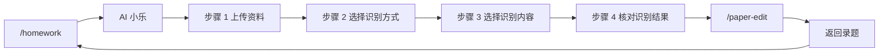

# 识别作业资料流程总 PRD

## 文档说明

本文档整合以下 5 份单页面 PRD，按系统模块、页面关系、操作路径、全局规则和来源索引重新组织，供 AI 或后续开发快速理解"识别作业资料"完整业务链路。

- `01-ai-chat-panel.prd.md`
- `02-upload-files-step.prd.md`
- `03-select-recognition-mode.prd.md`
- `04-select-recognition-content.prd.md`
- `05-review-recognition-results.prd.md`

## 第一部分：系统总览

### 1.1 项目背景

本项目为 OCR 作业识别专项优化，解决上传效率低、超限场景体验差、答案匹配成本高、异常流程易中断四大痛点。

### 1.2 系统目标

通过流程和交互优化支撑 OCR 组卷、AI 批改等核心业务规模化落地。当前文档覆盖从 AI 小乐入口到试卷编辑页交接前后的主要链路：

1. 教师在作业管理页打开 AI 小乐。
2. 教师通过 AI 小乐发起"识别作业资料"任务，直接进入步骤条弹窗。
3. 在步骤 1（上传资料）中选择本地上传或资源库资料，并确认学段学科、页码范围。
4. 在步骤 2（选择识别方式）中选择识别模式，多文件时分配文件用途。
5. 在步骤 3（选择识别内容）中检查或手动画框，并启动识别。
6. 在步骤 4（核对识别结果）中核查题目信息、答案解析、子题结构和图片裁剪结果。
7. 点击"加入试卷"，进入试卷编辑页继续编辑。

### 1.3 模块划分

| 模块 | 名称 | 包含页面 | 主要职责 | 来源 PRD |
|------|------|---------|---------|---------|
| M1 | AI 小乐任务入口 | AI 小乐侧边面板 | 提供识别作业资料快捷入口 | `01` |
| M2 | 上传录题流程 | 步骤 1~4（上传资料、选择识别方式、选择识别内容、核对识别结果） | 资料管理、识别模式、框选识别、题目核查和加入试卷 | `02` `03` `04` `05` |
| M3 | 下游交接 | `/paper-edit` 试卷编辑页 | 接收题目数据；支持返回录题 | 来源 `05` |

### 1.4 页面索引

| 页面 | 组件/步骤 | 所属模块 | 上游 | 下游 | 需求编号范围 |
|------|----------|---------|------|------|------------|
| P1 | AI 小乐侧边面板 | M1 | `/homework` | 步骤条弹窗 | `AI_CHAT_PANEL-004` `005` |
| P2 | 步骤 1 上传资料 | M2 | AI 小乐 | 步骤 2 | `UPLOAD_FILES_STEP-001`~`016` |
| P3 | 步骤 2 选择识别方式 | M2 | 步骤 1 | 步骤 3 | `SELECT_MODE-001`~`008` |
| P4 | 步骤 3 选择识别内容 | M2 | 步骤 2 | 步骤 4 | `BOX_STEP-001`~`014` |
| P5 | 步骤 4 核对识别结果 | M2 | 步骤 3 | `/paper-edit` | `REVIEW_STEP-001`~`033`（当前可见角标 1~26） |

### 1.5 主链路概览


```mermaid
flowchart LR
  A["/homework"] --> B["AI 小乐"]
  B --> C["步骤 1 上传资料"]
  C --> D["步骤 2 选择识别方式"]
  D --> E["步骤 3 选择识别内容"]
  E --> F["步骤 4 核对识别结果"]
  F --> G["/paper-edit"]
  G --> H["返回录题"]
  H --> A
```

## 第二部分：各模块详情

### 模块一：AI 小乐任务入口（M1）

#### 页面组成

AI 小乐侧边面板由 `/homework` 和 `/paper-edit` 打开。当前识别作业资料链路的主要入口在 `/homework`。

#### 业务职责

- 展示"帮我识别作业资料"快捷按钮。
- 点击后直接打开步骤条弹窗，定位到步骤 1（上传资料）。
- 底部输入框和发送按钮保留但禁用，当前版本不支持自由文本发起任务。

#### 需求索引

| 编号 | 标题 | 关键规则 |
|------|------|---------|
| `AI_CHAT_PANEL-004` | 识别作业资料快捷任务 | 点击后直接进入步骤条弹窗；AI 小乐只负责发起和引导 |
| `AI_CHAT_PANEL-005` | 底部文字输入区禁用 | 输入框和发送按钮禁用；当前版本仅支持快捷按钮操作 |

---

### 模块二：上传录题流程（M2）

模块二由四个连续步骤组成：上传资料 → 选择识别方式 → 选择识别内容 → 核对识别结果。


```mermaid
flowchart LR
  A["步骤 1 上传资料"] --> B["步骤 2 选择识别方式"]
  B --> C["步骤 3 选择识别内容"]
  C --> D["步骤 4 核对识别结果"]
  D --> E["加入试卷"]
```

#### 步骤 1：上传资料（P2）

**页面职责：**

- 接收从 AI 小乐进入的识别任务。
- 提供本地上传和我的资源库两个资料来源 Tab。
- 支持文件格式校验、页数检测、重复文件拦截。
- 展示已有资料页数提示（蓝色/红色条）和 24 页上限校验。
- 展示已上传文件列表，支持删除和识别范围调整。
- 要求选择学段学科，适用于本次任务所有文件。
- 点击"下一步"提交文件并进入步骤 2。

**核心规则：**

| 规则项 | 业务规则 | 编号 |
|--------|---------|------|
| 资料来源 | 本地上传和我的资源库两个 Tab，同一任务可混合使用 | `STEP-005` |
| 上传入口 | "上传资料"按钮，支持 PNG/JPG/PDF/DOC/DOCX，可多选 | `STEP-004` |
| 页数提示 | 蓝色/红色条展示已有页数 + 新选页数 + 剩余可选页数 | `STEP-012` `STEP-015` |
| 文件列表 | label-left 布局，每行含图标/名称/大小/页数入口/删除 | `STEP-002` `STEP-014` |
| 暂无文件 | 虚线缺省占位图 | `STEP-016` |
| 文件删除 | 确认弹窗，删除后按最新列表重新处理 | `STEP-003` |
| 学段学科 | 必填，适用于本次任务所有文件，未选时不能提交 | `STEP-008` |
| 24 页上限 | 超限琥珀色警告，"下一步"置灰 | `STEP-006` |
| 识别范围 | 多文件范围弹窗，支持连续页码调整 | `STEP-007` |
| 页数检测 | 检测期间"下一步"禁用，底部显示检测提示 | `STEP-013` |
| 下一步 | 提交文件进入步骤 2，需满足全部前置条件 | `STEP-011` |

#### 步骤 2：选择识别方式（P3）

**页面职责：**

- 展示三种识别模式卡片。
- 展示已上传文件列表（只读）。
- 多文件且选择"题目+答案（不同文件）"时弹出文件用途分配弹窗。
- 支持从后续步骤返回并清空识别进度。

**需求索引：**

| 编号 | 标题 | 关键规则 |
|------|------|---------|
| `SELECT_MODE-001` | 页面标题 | 展示"请选择识别方式"和引导文案 |
| `SELECT_MODE-002` | 仅识别题目卡片 | 多文件时全部按题目处理，不弹角色弹窗 |
| `SELECT_MODE-003` | 同文件模式卡片 | 按题目和答案在同一资料内处理 |
| `SELECT_MODE-008` | 不同文件模式卡片 | 至少 2 份文件时可点击，弹出文件用途弹窗 |
| `SELECT_MODE-004` | 已上传文件列表 | 展示文件名和识别页数 |
| `SELECT_MODE-005` | 文件用途分配弹窗 | 每份文件独立选择角色，取消保留临时分配 |
| `SELECT_MODE-006` | 返回模式选择确认 | 有进度时需弹窗确认并清空 |
| `SELECT_MODE-007` | 步骤条 | 第 2 步高亮，已完成的步骤 1 可点击返回 |

#### 步骤 3：选择识别内容（P4）

**页面职责：**

- 展示资料预览和识别框层（自动切题 + 手动画框）。
- 右侧悬浮操作（开始识别、清空）。
- 框选统计信息。
- 支持补充资料、更换资料、重新上传。
- 识别中展示进度和取消按钮。
- 增量识别时展示进度条。

**核心规则：**

| 规则项 | 编号 |
|--------|------|
| 资料选框层（呈现/操作/回退状态） | `BOX_STEP-010` |
| 框选统计（已选中 X 题 / 已框选 Y 题） | `BOX_STEP-001` |
| 开始/更新识别按钮 | `BOX_STEP-002` |
| 清空框选 | `BOX_STEP-014` |
| 右侧空状态引导 | `BOX_STEP-003` |
| 取消识别 | `BOX_STEP-007` |
| 增量识别进度条 | `BOX_STEP-011` |
| 文件用途分配弹窗 | `BOX_STEP-004` |
| 补充资料 | `BOX_STEP-005` |
| 更换资料 | `BOX_STEP-012` |
| 重新上传 | `BOX_STEP-006` |
| 继续上传切题提示 | `BOX_STEP-008` |
| 更多工具面板 | `BOX_STEP-013` |

#### 步骤 4：核对识别结果（P5）

**页面职责：**

- 依据左侧资料选框和识别结果展示、排序、编辑右侧题卡。
- 在图片模式和编辑模式下核对题干、题型、选项、子题、空位、答案和解析。
- 支持图片裁剪、人工关联、AI 回填、题型切换保护、题目删除和加入试卷。
- 覆盖仅识别题目、题目+答案，以及单选/多选、判断、填空、解答、完型填空、阅读理解等题型规则。

**页面数字角标需求索引：**

##### 仅识别题目模式及通用核查

| 页面角标 | 需求编号 | 标题 |
|---:|---|---|
| 1 | `REVIEW_STEP-006` | 图片模式与编辑模式切换 |
| 2 | `REVIEW_STEP-002` | 题目卡片展示（仅识别题目模式） |
| 3 | `REVIEW_STEP-013` | 题目卡片排序功能移除 |
| 4 | `REVIEW_STEP-014` | 删除题目卡片 |
| 5 | `REVIEW_STEP-007` | 题目图片裁剪功能 |
| 6 | `REVIEW_STEP-017` | 题型切换结构保护 |
| 7 | `REVIEW_STEP-012` | 核对识别结果步骤条回退确认 |
| 8 | `REVIEW_STEP-008` | 加入试卷按钮 |
| 9 | `REVIEW_STEP-009` | 识别失败降级处理 |
| 10 | `REVIEW_STEP-033` | AI识别与回填提示词 |

##### 仅识别题目：按题型核对

| 页面角标 | 需求编号 | 标题 |
|---:|---|---|
| 11 | `REVIEW_STEP-021` | 仅识别题目：单选题、多选题 |
| 12 | `REVIEW_STEP-022` | 仅识别题目：判断题 |
| 13 | `REVIEW_STEP-023` | 仅识别题目：填空题 |
| 14 | `REVIEW_STEP-024` | 仅识别题目：解答题 |
| 15 | `REVIEW_STEP-025` | 仅识别题目：完型填空题 |
| 16 | `REVIEW_STEP-026` | 仅识别题目：阅读理解题 |

##### 题目+答案模式

| 页面角标 | 需求编号 | 标题 |
|---:|---|---|
| 17 | `REVIEW_STEP-001` | 匹配状态提示（分步模式） |
| 18 | `REVIEW_STEP-015` | 题目卡片排序（题目+答案模式） |
| 19 | `REVIEW_STEP-016` | 删除题目卡片（题目+答案模式） |

##### 题目+答案：按题型核对

| 页面角标 | 需求编号 | 标题 |
|---:|---|---|
| 20 | `REVIEW_STEP-027` | 题目+答案：单选题、多选题 |
| 21 | `REVIEW_STEP-028` | 题目+答案：判断题 |
| 22 | `REVIEW_STEP-029` | 题目+答案：填空题 |
| 23 | `REVIEW_STEP-030` | 题目+答案：解答题 |
| 24 | `REVIEW_STEP-031` | 题目+答案：完型填空题 |
| 25 | `REVIEW_STEP-032` | 题目+答案：阅读理解题 |

##### 其他需求

| 页面角标 | 需求编号 | 标题 |
|---:|---|---|
| 26 | `REVIEW_STEP-019` | 题卡分组与排序规则 |

**完整规则：**

下列规则与 `05-review-recognition-results.prd.md` 同源，按当前页面可见数字角标顺序同步。

##### 仅识别题目模式及通用核查

###### 1. 图片模式与编辑模式切换（`REVIEW_STEP-006`）

来源：代码事实 + 确认决策；变更日期：【6.24】

**显示说明**

右侧顶部提供「图片模式」和「编辑模式」切换按钮：图片模式展示题目截图，编辑模式展示可编辑的识别文字，并提示「请注意甄别AI识别内容」。
【6.24】进入步骤 4 时，默认选中编辑模式。顶层处于图片模式时，单题仍可独立显示编辑模式。

**状态反馈**

1. 【6.24】进入步骤 4：默认编辑模式选中
2. 图片模式选中：绿色高亮
3. 编辑模式选中：绿色高亮
4. 切换中：显示加载动画

**操作说明**

【6.24】进入步骤 4 后默认进入编辑模式；用户仍可点击图片模式查看截图，或点击编辑模式编辑识别文字、题干、选项、子题和填空空位。
【6.20】两种模式仅切换视图：切回图片模式不弹窗，已编辑内容和图片裁剪结果均保留。点击步骤 3 的确认弹窗后，清空编辑的图片和文字数据。
【6.21】顶层图片模式下仍可将单题切为编辑模式。
仅当左侧已识别选框被调整并再次选中后，点击「更新识别结果」才显示确认弹窗。标题为「确认更新识别结果吗？」，弹窗文案为「被选中的待重新识别的题目，其题干、答案、解析等内容将全部重置」；确认后进入识别并以最新结果替换该题图片和编辑内容，取消则留在当前状态。

**后续流程**

视图切换保留当前题目的图片、识别文字、答案、解析和用户修改内容；更新识别确认后才替换对应题目的图片和编辑内容。

**异常边界**

【6.21】没有待更新识别结果时，切换图片模式或编辑模式不触发内容替换。


**验收标准**

1. 两种模式可切换
2. 切换有加载动画
3. 编辑模式可编辑内容
4. 图片模式显示截图
5. 【6.20】切回图片模式不弹窗且保留编辑内容
6. 【6.20】调整已识别选框并点击更新识别结果时，应显示「确认更新识别结果吗？」弹窗；点击取消不进入识别状态，点击确认并识别完成后替换对应题目的图片内容和编辑模式内容
7. 点击步骤条步骤3的确认弹窗后清空用户编辑的图片和文字数据
8. 【6.21】顶层图片模式下，单题应可切换为编辑模式
9. 【6.21】确认更新识别结果后，应同时替换对应题目的图片内容和编辑模式内容

###### 2. 题目卡片展示（仅识别题目模式）（`REVIEW_STEP-002`）

来源：代码事实 + 确认决策；变更日期：【6.23】

**显示说明**

仅识别题目模式下：右侧展示题卡的顺序，根据左侧选框在资料中的位置，按从上至下、从左至右显示；卡片包含「原卷：第 X 题」、题型和题干，不展示答案/解析。题号排序、补识别插入和重识别覆盖规则见「题卡排序规则」。
【6.23】图片模式展示题目截图，编辑模式展示可编辑题干，题干内容均随实际内容自然展开；各题型在图片模式和编辑模式下的作答结构、关联与回填规则见「仅识别题目：按题型核对」。

**状态反馈**

1. 【6.23】图片模式：显示题目截图；复合题有子题时显示子题概览区
2. 【6.23】编辑模式：显示识别文字和可编辑的选项文案
3. 【6.20】编辑模式：选项识别中时仅当前选项区显示「选项识别中...」

**操作说明**

用户可切换图片/编辑视图、编辑题号和题干；左侧题号框与右侧「原卷：第 X 题」可双向定位，题号可输入正整数。
【6.23】图片模式可裁剪题目图片；编辑模式可编辑题干，填空题在题干下方插入空位，单选题默认 A/B/C/D，判断题固定 A.对、B.错。
【6.20】编辑模式下，点击选项关联图标后框选题干选项，系统拆分并回填当前题选项文案；再次点击可取消，清空图标只清除选项文案。
【6.21】已识别选框即使调整为完全不同内容，点击「更新识别结果」仍覆盖其当前对应题卡。

**后续流程**

用户编辑结果保存在当前题卡；加入试卷的数据规则见「加入试卷」。

**异常边界**

识别失败时停留在框选阶段。


**验收标准**

1. 题目卡片正确展示
2. 右侧题号顺序应以左侧资料页题号顺序为准
3. 点击左侧题号框时右侧自动定位到对应题目
4. 单击右侧题号时左侧自动定位到对应资料位置
5. 图片/编辑模式可切换
6. 题型和内容可编辑
7. 【6.20】仅识别题目 + 编辑模式下，单选题和判断题选项内容可编辑，选项识别中应显示加载态
8. 【6.20】仅识别题目 + 编辑模式下，填空题点击插入空位后应在题干光标位置插入绿色空线并同步空位数量
9. 裁剪功能可用
10. 第4步补识别新增题后应按题号插入列表
11. 第4步重识别重复题后应原位置覆盖
12. 【6.23】仅识别题目 + 图片模式下，复合题子题概览区位于父题题干图片下方，题干下方不展示答题卡式作答区
13. 【6.23】仅识别题目 + 编辑模式下，父题结构操作区位于父题题干下方，选项区内不放置增删选项入口
14. 【6.21】调整已识别选框后，即使选框内容已经完全不是原选框内容，更新识别结果时也应覆盖当前选框对应题卡而不是新增题卡

###### 3. 题目卡片排序功能移除（`REVIEW_STEP-013`）

来源：代码事实 + 确认决策；变更日期：【6.21】

**显示说明**

题目卡片不提供拖动排序入口，卡片头部右侧提供上移、下移图标。首题上移按钮置灰，末题下移按钮置灰。
【6.21】右侧题卡使用连续列表，不按文件名或页码分组。

**状态反馈**

1. 默认顺序：按左侧选框在资料中的位置，从上至下、从左至右展示
2. 首题：上移按钮置灰
3. 末题：下移按钮置灰

**操作说明**

用户仅可点击上移或下移图标调整顺序；首题不能继续上移，末题不能继续下移。
【6.21】在核对识别结果的时候，右侧的内容移动了上下位置，这个时候，左侧再新增框，新增框在右侧的位置显示逻辑以新增框上方框的位置为锚点进行显示，，即，若原本左侧框的位置从上到下ABC，右侧也是ABC，后面用户在右侧调整顺序，调整为了BCA，这个时候，用户再在左侧的AB之间新增框【ADBC】，新增框在右侧显示的结果为【BCAD】，以上方信息为基准点的原因是，用户在知道规则的情况下，知道D会在A的下方，那么用户带着这样的理解去右侧找D的时候，从上往下找，在看到A的时候，就知道，下面就是D了，且比较好核对，如果是以新增框的下方框为基准点，用户在右侧从上往下看，看到D的时候，还需要再往下滑动，看下方是不是B才能确认准确性，相对而言不是那么方便，所以采用以新增框的上方框为基准点

**后续流程**

加入试卷时按当前题卡列表顺序传递。

**异常边界**

顺序不符合预期时，返回“选择识别内容”重新框选或重新识别。


**验收标准**

1. 题目卡片不展示拖动排序入口
2. 题目卡片保留上移和下移按钮
3. 第一题上移按钮置灰，最后一题下移按钮置灰
4. 裁剪功能可用时不与题目排序功能冲突
5. 加入试卷按当前核对列表顺序传递题目
6. 【6.21】左侧新增框后，新题卡应显示在新增框上方已有框对应的右侧题卡下方
7. 【6.21】右侧题卡不应展示文件名/页码分组标题

###### 4. 删除题目卡片（`REVIEW_STEP-014`）

来源：代码事实 + 确认决策；变更日期：【6.22】

**显示说明**

每张题目卡片头部右侧显示删除图标按钮，默认为灰色，悬停时红色强调并显示「删除题目」提示。点击删除后显示确认弹窗，标题为「确认删除该题目吗？」，文案为「删除该题目后，左侧对应题目的选框也将一并删除」。

**状态反馈**

1. 默认态：灰色
2. 悬停态：红色强调
3. 待确认：显示删除确认弹窗

**操作说明**

1、点击删除图标后先弹窗确认。
2、点击取消关闭弹窗并保留题目卡片和左侧选框。
3、点击确认删除后，右侧题目卡片从列表移除，左侧对应题目的选框一并删除。
4、被删除题目的全部内容不再加入试卷。

**后续流程**

删除后题目不再传递给试卷编辑页面，左侧与该题关联的选框同步移除。

**异常边界**

确认删除后不提供撤销入口，误删后需重新识别或补录。


**验收标准**

1. 点击删除后应先显示「确认删除该题目吗？」弹窗
2. 点击取消后题目卡片和左侧选框均保留
3. 点击确认删除后题目卡片从列表消失，左侧对应选框同步删除
4. 删除后的题目不加入试卷
5. 删除按钮悬停时有明显红色反馈

###### 5. 题目图片裁剪功能（`REVIEW_STEP-007`）

来源：代码事实

**显示说明**

编辑模式下每张题卡提供「使用图片」开关：关闭时显示可编辑识别文字，开启时显示题目截图。图片模式直接展示题目截图。题目有截图时，图片区域悬停显示「裁剪」按钮；已裁剪后显示「已裁剪」标记并提供「还原」按钮；没有截图时展示「暂无题目图片」占位。裁剪模式下图片四周显示调整手柄，底部展示「取消」「确认裁剪」按钮。

**状态反馈**

1. 未开启使用图片：显示可编辑识别文字
2. 开启使用图片：显示题目截图
3. 没有截图：显示暂无题目图片占位
4. 裁剪模式：显示调整手柄和操作按钮
5. 已裁剪：可还原到左侧框选的原始图片

**操作说明**

1、编辑模式下开启「使用图片」显示题目截图，关闭后回到识别文字编辑区。
2、点击题目截图可放大预览图片。
3、点击裁剪按钮进入裁剪模式，拖动四角或四边手柄调整范围。
4、确认裁剪保存结果，取消退出裁剪模式。
5、裁剪后可点击「还原」恢复到原始图片。

**后续流程**

裁剪结果保存到当前题目，加入试卷时随题目数据传递。


**验收标准**

1. 编辑模式下有使用图片开关
2. 图片模式下有裁剪按钮
3. 没有题目截图时应显示暂无题目图片占位
4. 确认裁剪保存结果
5. 取消不保存
6. 可还原到用户在左侧框选的图片

###### 6. 题型切换结构保护（`REVIEW_STEP-017`）

来源：代码事实 + 确认决策；变更日期：【6.23】

**显示说明**

题干上方显示题型选择器，父题题干下方预留当前题型的结构操作区。选项数、子题数、空数、插入空位和子题按钮的显示位置及具体规则，按当前识别模式和题型查看对应“按题型核对”角标。
【6.20】当该题型选项区域已有内容时，用户点击题型显示弹窗。弹窗标题为「确认切换题型吗？」；仅题目+编辑模式的文案为「切换题型将清空子题、选项或空位」，题目+答案+编辑/图片模式的文案为「切换题型将清空答案或解析」。按钮为「取消」「确认」。

**操作说明**

用户点击弹窗的「取消」后保持原题型和原内容；点击「确认」后按新题型调整结构。切换为非选择且非复合题时清空选项结构；多空填空答案先合并后再切换。各题型的结构操作按钮及其数量边界，见对应“按题型核对”角标。

**后续流程**

切换后的题型和结构化内容随题目数据传递给试卷编辑页面。用户取消切换时，当前模式下已有的题干或截图、选项、空位、答案和解析继续保留。


**验收标准**

1. 无结构化内容时可直接切换题型
2. 已有子题、扩展选项、多空答案、答案或解析时先显示确认弹窗
3. 取消后题型和内容不变
4. 确认后才按新题型调整结构
5. 确认弹窗文案与决策一致
6. 【6.20】已有子题，或选项数、填空空位数大于 1 时，切换题型前必须出现确认弹窗
7. 【6.20】确认弹窗标题和文案应分别为「确认切换题型吗？」和「切换题型将调整作答区域结构，可能清空子题、选项或空位设置。」
8. 【6.20】识别题目+答案 + 编辑模式下，已有答案或解析时切换题型前必须出现确认弹窗
9. 【6.20】题目+答案编辑模式确认弹窗文案应为「切换题型将调整题目结构，可能清空子题、选项、空位、答案或解析。」

###### 7. 核对识别结果步骤条回退确认（`REVIEW_STEP-012`）

来源：代码事实

**显示说明**

步骤4中，第1步「上传资料」、第2步「选择识别方式」、第3步「选择识别内容」为可点击回退节点，第4步为当前激活态（绿色高亮）。点击前三步时分别弹出对应确认弹窗。

**状态反馈**

1. 第1步：可点击，弹出确认更换资料弹窗
2. 第2步：可点击，弹出确认更换识别方式弹窗
3. 第3步：可点击，弹出确认重新选择识别内容弹窗
4. 第4步：绿色高亮当前激活态

**操作说明**

1、点击「上传资料」→ 弹窗「确认更换资料吗？」「更换资料将清空当前的识别结果。」
2、点击「选择识别方式」→ 弹窗「确认更换识别方式吗？」「更换识别方式将清空当前的识别结果。」
3、点击「选择识别内容」→ 弹窗「确认重新选择识别内容吗？」「重新选择识别内容将清空当前识别结果，并恢复进入步骤4之前框选的题目框。」
4、三个弹窗均为：取消留在步骤4，确认返回对应步骤。

**后续流程**

确认后按对应回退动作清空识别结果，取消则不清空。回退到步骤3时，回显进入步骤4之前的框选状态，而非进入步骤3时的初始框。

**异常边界**

未确认前不得离开步骤4。


**验收标准**

1. 点击步骤1应显示确认更换资料弹窗
2. 点击步骤2应显示确认更换识别方式弹窗
3. 点击步骤3应显示确认重新选择识别内容弹窗
4. 三个弹窗点击取消后均停留在步骤4
5. 三个弹窗点击确认后均返回对应步骤条位置

###### 8. 加入试卷按钮（`REVIEW_STEP-008`）

来源：代码事实 + 确认决策；变更日期：【6.22】

**显示说明**

通用规则：顶部步骤条右侧操作区显示「加入试卷」。有题目时按钮为绿色可点击，无题目时置灰。
【6.22】仅识别题目 + 图片模式：加入试卷前不展示答案/解析缺失校验状态；题目图片、题型、填空空位、子题结构和必要的选项结构作为题目结构进入试卷，题干下方答题卡式作答区不再作为页面展示对象。
【6.20】仅识别题目 + 编辑模式：加入试卷前不展示答案/解析缺失校验状态；老师调整过的题干、选项、子题题干、子题选项和填空空位作为题目结构进入试卷。
【6.20】题目+答案 + 图片模式：客观题选中项视为标准答案，解析区内容视为解析；未选中答案或缺少解析时，加入试卷前按答案/解析缺失处理。
【6.22】题目+答案 + 编辑模式：父题和子题的题干、选项文案、选中答案、解析、填空空位和空位答案作为最终核对内容进入试卷；单选题、多选题和判断题不使用独立答案输入区，页面通过选项选中态判断答案；填空题答案空位与题干下划线不匹配时，在加入试卷前合并提示。

**状态反馈**

1. 通用：有题目时按钮可点击，无题目时按钮置灰
2. 【6.22】仅识别题目 + 图片模式：不校验答案/解析缺失，不展示题干下方答题卡式作答区
3. 【6.20】仅识别题目 + 编辑模式：不校验答案/解析缺失
4. 【6.20】题目+答案 + 图片模式：缺少选中项或解析时显示加入试卷确认
5. 【6.22】题目+答案 + 编辑模式：客观题按选项选中态保存答案；一道大题存在任一父题或子题答案/解析缺失即计 1 道
6. 【6.20】题目+答案 + 编辑模式：填空答案空位与题干下划线不匹配时显示合并提示

**操作说明**

通用规则：加入试卷前保存当前状态，供从试卷编辑页返回时恢复；题目数据保存失败时停留在步骤4并提示「加入试卷失败，题目数据暂未保存，请重试」。
【6.22】仅识别题目 + 图片模式：点击加入试卷时，不检查答案/解析缺失，不弹出未匹配确认；系统保留题目图片、题型、填空空位、子题结构和必要的选项结构，清空标准答案、解析和空位答案。
【6.20】仅识别题目 + 编辑模式：点击加入试卷时，不检查答案/解析缺失，不弹出未匹配确认；系统保存编辑后的题干、选项文案、题型、填空空位、子题题干和子题选项，清空标准答案、解析和空位答案。
【6.20】题目+答案 + 图片模式：客观题保存选中选项和解析；若没有选中项或存在答案/解析缺失，点击加入试卷时弹窗「确认加入试卷吗？」和「当前还有 X 道题的答案/解析没有补充，您可以在后续组卷页面使用AI批量补充功能，进行补充。」；一道大题只要存在答案或解析缺失即计 1 道；取消停留在步骤4，确认进入后续组卷页面。
【6.22】题目+答案 + 编辑模式：加入试卷保存用户核对后的题干、选项文案、题型、填空空位、子题结构、选中答案和解析；单选题、多选题和判断题按选项选中态保存答案，不读取独立答案输入区；若一道大题存在任一父题或子题答案/解析缺失，缺失数量按 1 道统计并使用同一套加入试卷确认弹窗文案。
【6.20】题目+答案 + 编辑模式：加入试卷时额外校验填空题答案空位与题干下划线是否匹配；不匹配时在确认弹窗中合并展示「另有 X 道填空题的答案空位与题干空位不匹配」；空位不匹配按父题和子题独立统计；取消后若同时存在答案缺失和空位不匹配，各取第一个并优先定位到更靠近列表顶部的对象。

**后续流程**

题目数据传递给试卷编辑页面，弹窗状态暂存供返回恢复。【6.22】仅识别题目模式传递题目结构并清空标准答案、解析和空位答案。【6.20】题目+答案 + 图片模式下，客观题选中选项作为标准答案、解析区作为解析一起传递，填空题按空位答案传递，子题保持完整结构传递。【6.22】题目+答案 + 编辑模式下，用户编辑后的题干、选项、选中答案、解析和子题结构完整传递。

**异常边界**

有未匹配答案/解析时需弹窗二次确认。题目数据保存失败时阻断加入并提示。【6.20】题目+答案 + 图片模式下，客观题未选中答案或缺少解析也纳入答案/解析缺失统计。【6.22】题目+答案 + 编辑模式下，客观题没有选中答案时纳入答案缺失统计；缺失数量按大题统计，不按缺失字段或子题数量累加。


**验收标准**

1. 有题目时按钮可用
2. 无题目时按钮置灰
3. 有答案或解析缺口时显示「确认加入试卷吗？」弹窗
4. 点击取消后停留在步骤4
5. 点击确认后进入后续组卷页面
6. 加入后数据完整传递
7. 题目数据保存失败时停留在核查页并显示失败提示
8. 【6.20】仅识别题目模式加入试卷后，应保留作答结构并清空答案、解析和空位答案
9. 【6.20】仅识别题目模式不应因答案/解析缺失阻断加入试卷
10. 【6.20】仅识别题目 + 编辑模式加入试卷后，应保留编辑后的题干、选项文案和子题内容，并清空标准答案、解析和空位答案
11. 【6.20】识别题目+答案 + 图片模式下，客观题选中项和解析区内容会随题目加入试卷
12. 【6.20】客观题未选中答案或缺少解析时，加入试卷前显示答案/解析缺失确认弹窗
13. 【6.22】识别题目+答案 + 编辑模式下，客观题按选项选中态保存答案，不显示独立答案输入区
14. 【6.20】识别题目+答案 + 编辑模式下，任一父题或子题答案/解析缺失时，该大题按 1 道计入缺失数量

###### 9. 识别失败降级处理（`REVIEW_STEP-009`）

来源：代码事实 + 确认决策

**显示说明**

生产环境识别失败时停留在框选阶段，不进入核对页面。显示「识别失败，请调整框选范围后重试」。

**状态反馈**

1. 识别失败：停留在框选阶段

**操作说明**

1、AI 识别失败时不生成模拟数据，不进入核查页面。
2、用户可调整框选范围后重新识别。
3、仅识别题目模式下框选区域包含答案/解析时，由用户在核查页面通过裁剪手动处理。

**异常边界**

识别失败时需用户手动重试。


**验收标准**

1. 识别失败停留在框选阶段
2. 显示错误提示
3. 不生成模拟数据
4. 可重试

###### 10. AI识别与回填提示词（`REVIEW_STEP-033`）

来源：代码事实；变更日期：【6.23】

**显示说明**

【6.23】按框选文件、视图模式和回填目标展示当前实际调用的 AI 提示词。

**操作说明**

点击角标查看各提示词的触发条件、原始模板和结果回填位置。


**AI 提示词与回填**

**P1 图片模式选项/内容识别**

- 触发条件：框选题目文件；图片模式的选项或子题内容关联。
- 回填结果：有选项标记时回填选项；无选项标记时回填题干或子题题干。

```text
你是教育内容识别专家。用户框选了一个资料图片区域，请精准识别其中的文字内容，并按以下规则分类处理。

## 处理规则

### 规则1：存在选项标记
如果识别到的文字包含选择题的选项标记（A. / A、/ (A) / ① / A) / A．/ ㈠ 等格式）或判断题标记（对/错、正确/错误、√/×、T/F）：
- **hasOptions** 设为 true
- 将内容按选项标号拆分为独立选项
- 每个选项提取：**label**（标号本身，如 "A"/"B"/"对"/"错"/"①"/"②"）和 **content**（该选项对应的文字内容，不含标号）
- 选项内容跨行时保持完整性
- **plainContent** 填空字符串

### 规则2：无选项标记
如果识别到的文字不包含任何选项标记，仅为连续的文字内容：
- **hasOptions** 设为 false
- **plainContent** 填完整的识别文字（保留换行结构）
- **options** 填空数组

### 输出格式（严格JSON，不要其他内容）
{
  "hasOptions": true,
  "options": [{"label": "A", "content": "该选项对应的文字内容"}],
  "plainContent": ""
}

或

{
  "hasOptions": false,
  "options": [],
  "plainContent": "完整的文字内容"
}

### 约束
1. 选项标号不限于ABCD，也可能是①②③④、对/错、√/×、T/F等
2. label 只保留标号本身，不要附带标点（"."、"、"、"）"等）
3. content 是该选项的实际文字，不含标号
4. 数学公式使用纯文本：分数 a/b，上标 x^2，下标 x_1
5. 禁止 LaTeX
6. 只输出JSON
```

**P2 编辑模式选项/内容识别**

- 触发条件：框选题目文件；编辑模式的选项、子题题干关联或完型批量补全。
- 回填结果：有选项标记时回填选项文案；无选项标记时回填父题或子题题干。

```text
你是教育内容识别专家。用户框选了一个资料图片区域，请精准识别其中的文字内容，并将结果用于回填到题目编辑区。

## 处理规则

### 规则1：存在选项标记
如果识别到的文字包含选择题选项标记（A. / A、/ (A) / ① / A) / A．/ ㈠ 等格式）或判断题标记（对/错、正确/错误、√/×、T/F）：
- **hasOptions** 设为 true
- 按选项标号将内容拆分为独立选项
- 每个选项提取：**label**（标号本身）和 **content**（该选项的完整文字内容，跨行则合并）
- **plainContent** 填空字符串

### 规则2：无选项标记（纯题干/子题文字）
如果识别到的文字不包含选项标记，是连续的题干或子题内容：
- **hasOptions** 设为 false
- **plainContent** 填完整文字（保留段落结构）
- **options** 填空数组

### 输出格式（严格JSON）
{
  "hasOptions": true,
  "options": [{"label": "A", "content": "完整选项文字"}],
  "plainContent": ""
}

或

{
  "hasOptions": false,
  "options": [],
  "plainContent": "完整题干/子题文字"
}

### 约束
1. label 只保留标号本身，去掉附带的标点符号
2. content 是选项的实际文字内容，不包含标号
3. 跨行选项内容合并为完整文字
4. 保留原文中关键信息（数字、公式符号、特殊字符）
5. 数学公式使用纯文本，禁止LaTeX
6. 只输出JSON
```

**P3 编辑模式答案/解析识别**

- 触发条件：框选答案文件；编辑模式答案或解析关联。
- 回填结果：拆分后分别回填答案和解析；无法拆分时保留完整内容。

```text
你是教育内容识别专家。用户框选了一个资料图片区域，请识别其中的内容，判断是否同时包含"答案"和"解析"两部分，并按要求拆分。

## 处理规则

### 规则1：内容可区分出"答案"和"解析"
如果识别到的文字中能明确区分为答案和解析两部分（常见特征："答案：xxx 解析：xxx" / "【答案】xxx 【解析】xxx" / 前半段为简洁答案、后半段为详细解释说明等）：
- **hasSplit** 设为 true
- **answer**：提取答案部分的纯文字（去除"答案：""【答案】"等标记词）
- **analysis**：提取解析部分的纯文字（去除"解析：""【解析】"等标记词）
- 答案通常较短（几个字/一个选项字母/一个数字），解析通常较长
- 对于选择题，答案只返回选项字母（如 "A"）；对于判断题，返回 "对"/"错"；其他题型返回完整答案文字

### 规则2：内容无法区分答案和解析
如果识别到的文字是连续的、无法明确拆分出独立的答案和解析：
- **hasSplit** 设为 false
- **content** 填完整的识别文字

### 输出格式（严格JSON）
{
  "hasSplit": true,
  "answer": "答案文字",
  "analysis": "解析文字",
  "content": ""
}

或

{
  "hasSplit": false,
  "answer": "",
  "analysis": "",
  "content": "完整文字内容"
}

### 边界情况
- 只有"答案："标记而无"解析："标记 → answer 填答案内容，analysis 填空，hasSplit 为 true
- 只有"解析："标记而无"答案："标记 → analysis 填解析内容，answer 填空，hasSplit 为 true
- 答案和解析标记词本身不包含在返回内容中

### 约束
1. 数学公式使用纯文本，禁止LaTeX
2. 只输出JSON
```

**P4 图片模式答案/解析识别**

- 触发条件：框选答案文件；图片模式答案或解析关联。
- 回填结果：选择题回填候选答案，判断题回填对错，其他题型回填答案/解析原文。

```text
你是教育内容识别专家。用户框选了一个资料图片区域，请识别其中的内容，判断是否包含"答案"和"解析"，并按以下规则返回。

## 处理规则

### 规则1：内容可区分出"答案"和"解析"
如果识别到的文字中能明确区分为答案和解析两部分：
- **hasSplit** 设为 true
- **answer**：提取答案部分。**重要**——如果是选择题，答案只返回选项字母（如 "A"/"B"/"C"/"D"）；如果是判断题，返回 "对"/"错"；其他题型返回答案原文
- **analysis**：提取解析部分的完整文字（去除标记词）
- 答案部分通常很短（一个字母/一个词），解析部分通常较长

### 规则2：内容无法区分答案和解析
如果识别到的文字是连续的、无法拆分：
- **hasSplit** 设为 false
- **content** 填完整识别文字（通常整段都是解析说明）

### 输出格式（严格JSON）
{
  "hasSplit": true,
  "answer": "A",
  "analysis": "解析文字内容",
  "content": ""
}

或

{
  "hasSplit": false,
  "answer": "",
  "analysis": "",
  "content": "完整文字内容"
}

### 约束
1. 选择题答案必须只返回选项字母（A/B/C/D等），判断题返回"对"/"错"
2. "答案：""解析："等标记词不包含在返回内容中
3. 数学公式使用纯文本，禁止LaTeX
4. 只输出JSON
```

**P5 候选答案匹配**

- 触发条件：框选答案文件；单选、多选、判断题的选项关联。
- 回填结果：匹配成功则选中对应候选项；失败提示未匹配到合适的选项。

```text
你是教育内容识别专家。用户框选了试卷答案区域，请只判断其中是否包含选择题候选答案。

## 任务
只做 OCR 提取和候选项匹配，不要解题、不要推理、不要生成答案。

## 匹配规则
1. 如果图片中明确出现 A/B/C/D/E/F 等选项字母，提取最明确的一个选项字母。
2. 支持常见格式："答案：B"、"选B"、"B"、"1.B"、"第1题 B"、"（B）"。
3. 如果是判断题答案，"对/正确/是/√/✓" 视为 A，"错/错误/否/×/✕/✗" 视为 B。
4. 如果图片中没有明确候选项，或同时出现多个无法判断哪个属于当前题目的候选项，matched 必须为 false。

## 输出格式（严格JSON，不要其他内容）
{
  "matched": true,
  "option": "B",
  "rawText": "从图片中识别到的原文"
}

或

{
  "matched": false,
  "option": "",
  "rawText": "从图片中识别到的原文"
}

## 约束
1. option 只能是单个大写字母 A-Z；判断题也按 A/B 返回。
2. 不返回解析，不返回完整答案内容。
3. 看不清或不确定时返回 matched:false。
4. 只输出JSON
```

**P6 全局答案匹配**

- 触发条件：识别题目+答案模式下，对所有未匹配题目扫描答案文件。
- 回填结果：按题号为父题或子题回填答案、解析与匹配状态。

```text
你是专业的试卷答案【提取】专家。任务是从答案资料图片中原样提取已印刷的答案和解析，绝不生成或推理答案。

## 核心原则
1. 只能识别和提取图片中已有的答案、解析文字；找不到时 answer 和 analysis 必须为空字符串。
2. 禁止根据题目内容自行推理、计算、编写答案或解析；宁可留空，不可编造。

## 待匹配题目
{{questionsDetail}}

## 图片信息
共 {{pageCount}} 页，依次为：{{pageListDesc}}

## 答案分布参考
1. 选择题答案通常以“1.A 2.B 3.C...”或表格形式出现在资料后半部分。
2. 填空题、完型填空题答案通常紧跟题目后或位于答案汇总区。
3. 阅读理解答案通常位于材料后或统一位于末尾。
4. 书面表达、翻译通常只有评分标准或范文；未找到时不填。

## 匹配规则
1. 通过题号精确匹配：第 N 题答案必须对应图片中的“N.”或“第N题”标记。
2. 检查全部页面寻找答案，找不到时将该题 answer 和 analysis 留空，found 为 false。
3. 复合题需要保留（1）、(1)、1.、①等子题标号及对应原文；前端据此再拆分到子题。
4. 同一题同时包含答案和解析时，优先按图片原文中的“答案”“解析”标识拆分；无法可靠拆分时，完整保留混排原文，不删除子题标号、答案标识或解析标识。

## 输出格式
仅返回 JSON 数组：
[
  {
    "questionId": "输入中的原始题目 ID",
    "questionNumber": "题号",
    "answer": "从图片提取的答案原文，找不到则为空字符串",
    "analysis": "从图片提取的解析原文，找不到则为空字符串",
    "subQuestions": [],
    "found": true
  }
]

found 为 false 时 answer 和 analysis 必须都是空字符串；subQuestions 固定返回空数组，子题标号和原文保留在父级 answer / analysis 中。
```

**验收标准**

1. 可查看题目文件和答案文件的提示词差异
2. 可查看每个提示词的回填目标

##### 仅识别题目：按题型核对

###### 11. 仅识别题目：单选题、多选题（`REVIEW_STEP-021`）

来源：代码事实 + 确认决策；变更日期：【6.23】

**显示说明**

【6.23】图片模式和编辑模式均在父题题干下方显示「选项数」操作区；图片模式只显示选项数设置值，编辑模式默认显示 A/B/C/D 字母及可编辑选项文案。题干和选项内容可分别清空，清空不改变题型或选项数。

**操作说明**

【6.23】【6.23】「选项数」支持加减和直接输入，范围为 2–26。编辑模式点击选项后的关联 icon，可在题目文件框选题干，系统识别并回填选项内容，作为手动兜底能力；关联中仅当前选项区显示「选项识别中...」，再次点击可取消。理想识别结果应将主题干显示在上方题干区、选项内容显示在下方选项区；进入下游业务时分别使用用户在主题干区和选项区确认后的内容。

**后续流程**

加入试卷时按当前题型结构和核对结果传递。


**验收标准**

1. 仅识别题目：单选题、多选题在图片模式和编辑模式下按对应规则展示
2. 仅识别题目：单选题、多选题的操作结果保存到当前题目结构

###### 12. 仅识别题目：判断题（`REVIEW_STEP-022`）

来源：代码事实 + 确认决策；变更日期：【6.23】

**显示说明**

【6.23】不显示「选项数」操作区；图片模式仅显示题型，编辑模式默认显示 A.对、B.错，选项内容可编辑并可单独清空。

**操作说明**

【6.23】【6.23】判断题在编辑模式下的系统自动拆分回填、关联 icon 手动兜底、局部加载与取消关联逻辑，同单选题。

**后续流程**

加入试卷时按当前题型结构和核对结果传递。


**验收标准**

1. 仅识别题目：判断题在图片模式和编辑模式下按对应规则展示
2. 仅识别题目：判断题的操作结果保存到当前题目结构

###### 13. 仅识别题目：填空题（`REVIEW_STEP-023`）

来源：代码事实 + 确认决策；变更日期：【6.23】

**显示说明**

【6.23】父题题干下方：图片模式显示「空数」操作区；编辑模式显示「插入空位」按钮，题干内以绿色空线表示作答位置。题干内容可清空，清空题干不改变空位数量。

**操作说明**

【6.23】【6.24】图片模式通过「空数」的加减按钮调整空位：点击「+」在最后新增一个作答空位，点击「-」删除最后一个作答空位。编辑模式点击「插入空位」在当前光标位置插入空线。未定位光标时显示「请将光标定位至要插入的题干位置」；达到 20 个空位提示「单题最多支持插入20个空位」。

**后续流程**

加入试卷时按当前题型结构和核对结果传递。


**验收标准**

1. 仅识别题目：填空题在图片模式和编辑模式下按对应规则展示
2. 仅识别题目：填空题的操作结果保存到当前题目结构

###### 14. 仅识别题目：解答题（`REVIEW_STEP-024`）

来源：代码事实 + 确认决策；变更日期：【6.23】

**显示说明**

【6.23】父题题干下方显示「子题」按钮。图片模式下，已有子题集中显示序号、题型和删除入口：单选/多选子题在子题头部显示「选项」加减控件，填空子题显示「空数」加减控件，判断和主观子题不显示数量控件；编辑模式下，父题题干显示在上方，系统按题干子题标记创建子题，主观子题显示子题题干，单选/判断子题显示子题题干及选项区。题干、子题题干和选项文案均可分别清空，清空不改变题型、选项数或子题数。

**操作说明**

【6.23】【6.23】点击「子题」新增子题；子题之间和最后一个子题末尾可插入子题。单选/多选子题的选项数在子题头部调整，最少 2、最多 26；填空子题图片模式的空数在子题头部调整，最少 1、最多 20，编辑模式的「插入空位」按钮位于子题题干下方。
【6.24】填空子题在图片模式下点击「空数」的「+」时，在最后新增一个作答空位；点击「-」时，删除最后一个作答空位。点击已有答案或解析的子题删除按钮时，显示「确认删除当前子题吗？」弹窗，按钮为「取消」「确认」；取消仅隐藏弹窗，确认后删除当前子题并自动更新其他子题序号。任何子题的子题题干或选项后均提供关联 icon：点击后高亮，用户在题目文件框选内容，系统识别后回填对应子题题干或选项；处理时仅当前区域显示「题干识别中...」或「选项识别中...」，再次点击可取消关联。
【6.24】识别结果中以「（1）」「(1)」「1.」「1、」「1)」「①」等连续编号标识的内容自动拆成子题；选择子题的 A/B/C/D 等选项文本自动分离并回填子题选项区。

**后续流程**

加入试卷时按当前题型结构和核对结果传递。


**验收标准**

1. 仅识别题目：解答题在图片模式和编辑模式下按对应规则展示
2. 仅识别题目：解答题的操作结果保存到当前题目结构

###### 15. 仅识别题目：完型填空题（`REVIEW_STEP-025`）

来源：代码事实 + 确认决策；变更日期：【6.23】

**显示说明**

【6.23】父题题干下方依次显示「子题数」「选项数」操作区；图片模式下子题集中显示序号和题型，子题内不显示独立题干；编辑模式下每个子题显示题型和统一选项内容，子题无独立题干。子题选项内容可清空，清空不改变统一选项数或子题数。

**操作说明**

【6.23】「子题数」支持 0 起的加减和直接输入，「选项数」支持 2–26 的加减和直接输入；子题内不单独调整选项数。编辑模式下系统识别应回填各子题选项内容；用户可点击选项关联 icon 在题目文件框选后拆分回填。批量补全开启后，系统隐藏左侧的选框，用户可自主在左侧框选内容；用户松开鼠标后，系统识别并拆分框选内容，自动回显到右侧第一个所有选项内容为空的子题。松开鼠标后仅目标子题显示识别中的加载效果。识别到选项标记时按 A/B/C/D 等标签回填选项内容；未识别到选项标记时提示「未识别到选项标记，请重试」；完成后提示已填入第 X 小题，用户可关闭批量补全恢复隐藏选框。

**后续流程**

加入试卷时按当前题型结构和核对结果传递。


**验收标准**

1. 仅识别题目：完型填空题在图片模式和编辑模式下按对应规则展示
2. 仅识别题目：完型填空题的操作结果保存到当前题目结构

###### 16. 仅识别题目：阅读理解题（`REVIEW_STEP-026`）

来源：代码事实 + 确认决策；变更日期：【6.23】

**显示说明**

【6.23】【6.24】阅读理解题按解答题规则管理子题。父题题干下方显示「子题」按钮。图片模式下，已有子题集中显示序号、题型和删除入口：单选/多选子题在子题头部显示「选项」加减控件，填空子题显示「空数」加减控件，判断和主观子题不显示数量控件；编辑模式下，父题题干显示在上方，主观子题显示子题题干，单选/判断子题显示子题题干及选项区。题干、子题题干和选项文案均可分别清空，清空不改变题型、选项数或子题数。

**操作说明**

【6.23】【6.24】点击「子题」新增子题；子题之间和最后一个子题末尾可插入子题。单选/多选子题的选项数在子题头部调整，最少 2、最多 26；填空子题图片模式的空数在子题头部调整，最少 1、最多 20，编辑模式的「插入空位」按钮位于子题题干下方。子题题干和选项后的关联 icon 分别回填对应子题题干或选项；处理时仅当前区域显示「题干识别中...」或「选项识别中...」，再次点击可取消关联。
【6.24】识别结果中以「（1）」「(1)」「1.」「1、」「1)」「①」等连续编号标识的内容自动拆成子题；选择子题的 A/B/C/D 等选项文本自动分离并回填子题选项区。

**后续流程**

加入试卷时按当前题型结构和核对结果传递。


**验收标准**

1. 仅识别题目：阅读理解题在图片模式和编辑模式下按对应规则展示
2. 仅识别题目：阅读理解题的操作结果保存到当前题目结构

##### 题目+答案模式

###### 17. 匹配状态提示（分步模式）（`REVIEW_STEP-001`）

来源：代码事实 + 确认决策

**显示说明**

题目+答案模式下，右侧面板顶部显示匹配状态提示条。存在待匹配题目时：「识别结果：共 X 道题目，已匹配答案 Y 题，待匹配答案 N 题（待匹配答案的题目，可在左侧框选答案/解析手动关联题目）」。全部匹配后：「全部题目已匹配答案和解析，可将题目加入试卷了~」。提示条始终完整展示，不可收起或展开。

**状态反馈**

1. 存在待匹配题目
2. 全部匹配


**验收标准**

1. 存在待匹配题目时，提示条正确显示识别结果统计
2. 待匹配数量正确
3. 全部题目均已匹配答案/解析时，提示条显示「全部题目已匹配答案和解析，可将题目加入试卷了~」

###### 18. 题目卡片排序（题目+答案模式）（`REVIEW_STEP-015`）

来源：代码事实 + 确认决策；变更日期：【6.21】

**显示说明**

题目+答案模式下，题目卡片提供上移、下移图标，不提供拖动排序。首题上移置灰，末题下移置灰。
【6.21】右侧题卡使用连续列表，不按文件名或页码分组。

**状态反馈**

1. 首题：上移置灰
2. 末题：下移置灰
3. 中间题目：上移和下移均可

**操作说明**

用户仅可点击上移、下移图标调整题目顺序。
【6.21】左侧新增框后，右侧新题卡以新增框上方已有框对应的当前题卡为锚点，插入该题卡下方；用户已调整右侧顺序时，仍以调整后的当前位置为准。

**后续流程**

加入试卷时按当前右侧题卡列表顺序传递。

**异常边界**

首题不可继续上移，末题不可继续下移。


**验收标准**

1. 题目卡片展示上移和下移操作图标
2. 题目卡片不展示拖动排序入口
3. 用户只能通过上移、下移改变题目顺序
4. 裁剪功能可用时不与题目排序功能冲突
5. 加入试卷按当前右侧最终顺序传递题目、答案和解析
6. 【6.21】左侧新增框后，新题卡应显示在新增框上方已有框对应的右侧题卡下方
7. 【6.21】右侧题卡不应展示文件名/页码分组标题

###### 19. 删除题目卡片（题目+答案模式）（`REVIEW_STEP-016`）

来源：代码事实 + 确认决策；变更日期：【6.23】

**显示说明**

每张题目卡片头部右侧显示删除图标按钮，默认为灰色，悬停时红色强调并显示「删除题目」提示。点击后显示删除确认弹窗。

**状态反馈**

1. 默认态：灰色
2. 悬停态：红色强调
3. 点击删除：显示确认弹窗

**操作说明**

点击删除图标后显示弹窗。弹窗标题为「确认删除该题目吗？」；弹窗文案为「删除该题目后，左侧对应题目的选框也将一并删除」；按钮为「取消」「确认删除」。点击取消关闭弹窗并保留题目卡片和左侧选框；点击确认删除后，右侧题目卡片和左侧对应选框一并删除。

**后续流程**

删除后题目、答案和解析不再传递给试卷编辑页面。


**验收标准**

1. 点击删除后显示「确认删除该题目吗？」弹窗
2. 取消后题目卡片和左侧选框均保留
3. 确认删除后题目卡片和左侧选框同步移除
4. 删除后的题目不加入试卷
5. 删除按钮悬停时有明显红色反馈

##### 题目+答案：按题型核对

###### 20. 题目+答案：单选题、多选题（`REVIEW_STEP-027`）

来源：代码事实 + 确认决策；变更日期：【6.23】

**显示说明**

【6.23】题卡显示匹配状态「答案解析已匹配」「未匹配到答案」「未匹配到解析」或「未匹配到答案和解析」。父题题干下方显示「选项数」操作区。图片模式显示可选中选项和解析区；编辑模式显示可编辑选项文案，选中项字母和内容同步高亮；不显示独立答案区。

**操作说明**

【6.23】「选项数」支持加减和直接输入，范围为 2–26。
【6.24】点击「选项」后的关联 icon 后，不区分题目文件或答案文件，用户均可在左侧框选内容；系统识别后，将符合当前选项区域填写规范的结果回填到被操作的选项区域。关联中仅当前选项区显示加载；未识别到符合规范的内容时，不回填，并提示「未识别到符合规范的内容，请重新框选或填写」。取消选中可清空答案，题干/选项/解析可分别清空且不改变题型或选项数。

**后续流程**

加入试卷时按当前题型结构和核对结果传递。


**验收标准**

1. 题目+答案：单选题、多选题在图片模式和编辑模式下按对应规则展示
2. 题目+答案：单选题、多选题的操作结果保存到当前题目结构

###### 21. 题目+答案：判断题（`REVIEW_STEP-028`）

来源：代码事实 + 确认决策；变更日期：【6.23】

**显示说明**

【6.23】题卡显示当前答案/解析匹配状态。不显示「选项数」操作区；图片模式显示“对 / 错”选项和解析区，编辑模式显示 A.对、B.错，选中项承载答案。

**操作说明**

【6.23】判断题固定两个候选项。
【6.24】点击「选项」后的关联 icon 后，不区分题目文件或答案文件，用户均可在左侧框选内容；系统识别后，将符合当前选项区域填写规范的结果回填到被操作的选项区域。关联中仅当前选项区显示加载；未识别到符合规范的内容时，不回填，并提示「未识别到符合规范的内容，请重新框选或填写」。取消选中可清空答案，选项文案和解析可分别清空。

**后续流程**

加入试卷时按当前题型结构和核对结果传递。


**验收标准**

1. 题目+答案：判断题在图片模式和编辑模式下按对应规则展示
2. 题目+答案：判断题的操作结果保存到当前题目结构

###### 22. 题目+答案：填空题（`REVIEW_STEP-029`）

来源：代码事实 + 确认决策；变更日期：【6.23】

**显示说明**

【6.23】题卡显示当前答案/解析匹配状态。父题题干下方：图片模式显示「空数」操作区和按空位的答案；编辑模式显示「插入空位」按钮，绿色空线与答案空位顺序对应。答案、解析和单个空位均有对应清空入口。

**操作说明**

【6.23】【6.24】图片模式通过「空数」的加减按钮调整答案空位：点击「+」在最后新增一个答案空，点击「-」删除最后一个答案空及其对应答案内容。编辑模式插入空位后同步新增答案空位。点击答案或解析关联 icon 后，当前题的答案、解析区域同时显示识别中，识别结果自动拆分回填；答案内容含中英文分号时按出现顺序拆分并回填多个空位，不符合填写规则时提示重新框选或填写。

**后续流程**

加入试卷时按当前题型结构和核对结果传递。


**验收标准**

1. 题目+答案：填空题在图片模式和编辑模式下按对应规则展示
2. 题目+答案：填空题的操作结果保存到当前题目结构

###### 23. 题目+答案：解答题（`REVIEW_STEP-030`）

来源：代码事实 + 确认决策；变更日期：【6.23】

**显示说明**

【6.23】题卡显示当前答案/解析匹配状态。父题题干下方显示「子题」按钮；系统可按题干标记生成子题并按答案标记拆分对应答案、解析。父题和子题显示对应答案、解析核对区；客观子题以选项选中态承载答案，填空子题按空位显示答案，主观子题显示独立答案和解析。题干、选项、答案、解析和空位均有对应清空入口。

**操作说明**

【6.23】点击「子题」新增子题；子题之间和最后一个子题末尾可插入子题。点击父题或子题答案/解析关联 icon 后，仅当前对象的答案、解析区域同时显示识别中，识别结果自动拆分回填。
【6.24】客观子题点击「选项」后的关联 icon 后，不区分题目文件或答案文件，用户均可在左侧框选内容；系统识别后，将符合当前选项区域填写规范的结果回填到被操作的选项区域。关联中仅当前子题选项区显示加载；未识别到符合规范的内容时，不回填，并提示「未识别到符合规范的内容，请重新框选或填写」。
【6.24】填空子题在图片模式下通过「空数」的加减按钮调整答案空位：点击「+」在最后新增一个答案空，点击「-」删除最后一个答案空及其对应答案内容。填空子题多空答案支持分号、逗号、顿号、序号、空格、斜杠和竖线拆分；不符合填写规则时提示重新框选或填写。

**后续流程**

加入试卷时按当前题型结构和核对结果传递。


**验收标准**

1. 题目+答案：解答题在图片模式和编辑模式下按对应规则展示
2. 题目+答案：解答题的操作结果保存到当前题目结构

###### 24. 题目+答案：完型填空题（`REVIEW_STEP-031`）

来源：代码事实 + 确认决策；变更日期：【6.23】

**显示说明**

【6.23】题卡显示当前答案/解析匹配状态。父题题干下方依次显示「子题数」「选项数」操作区；子题无独立题干，不逐题显示解析，只在全部子题后显示父题解析区。子题选项可清空，父题解析可清空，清空不改变子题数或统一选项数。

**操作说明**

【6.23】「子题数」支持 0 起的加减和直接输入，「选项数」支持 2–26 的加减和直接输入；选项选中态承载答案。
【6.24】点击子题「选项」后的关联 icon 后，不区分题目文件或答案文件，用户均可在左侧框选内容；系统识别后，将符合当前选项区域填写规范的结果回填到被操作的选项区域。关联中仅当前子题选项区显示加载；未识别到符合规范的内容时，不回填，并提示「未识别到符合规范的内容，请重新框选或填写」。父题解析可手动关联并在识别时显示解析加载态，识别结果回填父题解析并随整道大题保存。

**后续流程**

加入试卷时按当前题型结构和核对结果传递。


**验收标准**

1. 题目+答案：完型填空题在图片模式和编辑模式下按对应规则展示
2. 题目+答案：完型填空题的操作结果保存到当前题目结构

###### 25. 题目+答案：阅读理解题（`REVIEW_STEP-032`）

来源：代码事实 + 确认决策；变更日期：【6.23】

**显示说明**

【6.23】【6.24】阅读理解题按解答题规则管理子题。题卡显示当前答案/解析匹配状态，父题题干下方显示「子题」按钮；系统可按题干标记生成子题并按答案标记拆分对应答案、解析。父题和子题显示对应答案、解析核对区；客观子题以选项选中态承载答案，填空子题按空位显示答案，主观子题显示独立答案和解析。题干、选项、答案、解析和空位均有对应清空入口。

**操作说明**

【6.23】【6.24】点击「子题」新增子题；子题之间和最后一个子题末尾可插入子题。点击父题或子题答案/解析关联 icon 后，仅当前对象的答案、解析区域同时显示识别中，识别结果自动拆分回填。客观子题点击「选项」后的关联 icon 后，不区分题目文件或答案文件，用户均可在左侧框选内容；系统识别后，将符合当前选项区域填写规范的结果回填到被操作的选项区域。关联中仅当前子题选项区显示加载；未识别到符合规范的内容时，不回填，并提示「未识别到符合规范的内容，请重新框选或填写」。填空子题在图片模式下通过「空数」的加减按钮调整答案空位：点击「+」在最后新增一个答案空，点击「-」删除最后一个答案空及其对应答案内容。

**后续流程**

加入试卷时按当前题型结构和核对结果传递。


**验收标准**

1. 题目+答案：阅读理解题在图片模式和编辑模式下按对应规则展示
2. 题目+答案：阅读理解题的操作结果保存到当前题目结构

##### 其他需求

###### 26. 题卡分组与排序规则（`REVIEW_STEP-019`）

来源：代码事实 + 确认决策；变更日期：【6.16】

**显示说明**

【6.21】右侧题卡列表不按文件名或页码分组，不显示文件名、页码或分组标题。

**状态反馈**

1. 【6.21】多文件、多页和单文件、单页均使用同一连续题卡列表

**操作说明**

题卡排序和新增框插入规则见「题卡排序操作」。


**验收标准**

1. 分组标题正确显示文件名和页码
2. 组内排序按来源框空间位置排列
3. 上移/下移按钮可用
4. 加入试卷保留手动排序结果

---

### 模块三：试卷编辑页交接（M3）

- 入口：步骤 4 右上角"加入试卷"。
- 前置：有题目数据；答案解析缺口需二次确认。
- 传出数据：父题、子题、子题答案/解析、填空空位答案、题型、选项数、题目图片、学段学科。
- 返回逻辑：试卷编辑页点击"返回录题"回到 `/homework`，可恢复弹窗状态。

## 第三部分：操作路径

### 3.1 主路径：仅识别题目

1. 打开 AI 小乐 → 点击"帮我识别作业资料" → 直接进入步骤条弹窗步骤 1。
2. 上传文件或选择资源库资料，选择学段学科。
3. 点击"下一步"进入步骤 2。
4. 选择"仅识别题目"。
5. 进入步骤 3，系统自动切题，默认选中框。
6. 点击"开始识别"。
7. 进入步骤 4，核查题目内容和图片。
8. 点击"加入试卷"进入 `/paper-edit`。

### 3.2 主路径：识别题目和答案

1. 上传文件，选择学段学科，进入步骤 2。
2. 选择"题目+答案（同文件 或 不同文件）"。
3. 不同文件模式时先完成文件用途分配。
4. 步骤 3 框选识别，右侧展示题干+答案+解析。
5. 步骤 4 核查匹配状态，处理未匹配答案。
6. 点击"加入试卷"，有缺口时二次确认后进入 `/paper-edit`。

### 3.3 分支路径：补充资料

- 步骤 3 "更多工具" → "补充资料" → 打开资料选择弹窗（仅本地上传）。
- 仅识别题目/同文件模式：直接自动切题。
- 不同文件模式：弹出文件用途分配弹窗，取消则撤回补充文件。

### 3.4 分支路径：更换资料 / 重新上传

- 更换资料：返回步骤 1，已有识别结果时需确认清空。
- 重新上传：确认后清空全部数据，回到步骤 1 并回显文件列表。

### 3.5 分支路径：手动关联答案

- 步骤 4 点击题卡内【答案】或【解析】后的关联图标进入关联态。
- 跨文件模式自动定位到答案文件。
- 左侧框选内容后识别结果自动填入对应区域。

### 3.6 分支路径：返回录题

- 试卷编辑页点击"返回录题" → 回到 `/homework` → 恢复弹窗。

## 第四部分：全局规则

### 4.1 权限
- 沿用作业管理页 AI 小乐识别资料入口的使用权限。

### 4.2 资料规则
- 支持 PNG/JPG/JPEG/PDF/DOC/DOCX，不支持格式拦截。
- 重复文件拦截。页数检测失败文件自动移出。
- 本次识别任务最多 24 页。页码范围仅支持单个连续范围。

### 4.3 学科规则
- 学段学科必选，适用于本次任务所有文件。
- 加入试卷后试卷带有学科信息。

### 4.4 模式规则

| 模式 | 适用场景 | 多文件处理 |
|------|---------|-----------|
| 仅识别题目 | 只含题目不含答案 | 全部按题目文件处理 |
| 题目+答案（同文件） | 题目和答案在同一资料 | 按同一资料内处理 |
| 题目+答案（不同文件） | 题目和答案分文件 | 需分配文件用途 |

### 4.5 异常规则
- 格式不支持 → 拦截提示。页数检测失败 → 移出文件。
- 超 24 页 → 禁用提交。自动切题失败 → 允许手动画框。
- 识别失败 → 不生成模拟数据，停留在框选阶段可重试。
- 答案无法拆分 → 保留父题区并提示人工拆分。
- 加入试卷有缺口 → 允许带缺口加入但需二次确认。

## 第五部分：需求编号索引

### AI 小乐面板
| 编号 | 标题 |
|------|------|
| `AI_CHAT_PANEL-004` | 识别作业资料快捷任务 |
| `AI_CHAT_PANEL-005` | 底部文字输入区禁用 |

### 步骤 1 上传资料
| 编号 | 标题 |
|------|------|
| `UPLOAD_FILES_STEP-001` | 上传资料步骤条 |
| `UPLOAD_FILES_STEP-002` | 已上传文件列表 |
| `UPLOAD_FILES_STEP-003` | 文件删除 |
| `UPLOAD_FILES_STEP-004` | 上传资料入口 |
| `UPLOAD_FILES_STEP-005` | 资料来源 Tab 切换 |
| `UPLOAD_FILES_STEP-006` | 24 页上限 |
| `UPLOAD_FILES_STEP-007` | 多文件识别范围调整 |
| `UPLOAD_FILES_STEP-008` | 学段学科 |
| `UPLOAD_FILES_STEP-011` | 下一步按钮 |
| `UPLOAD_FILES_STEP-012` | 已有资料页数提示 |
| `UPLOAD_FILES_STEP-013` | 文件页数检测中 |
| `UPLOAD_FILES_STEP-014` | 文件列表行展示 |
| `UPLOAD_FILES_STEP-015` | 新增文件页数提示 |
| `UPLOAD_FILES_STEP-016` | 暂无文件缺省图 |

### 步骤 2 选择识别方式
| 编号 | 标题 |
|------|------|
| `SELECT_MODE-001` | 页面标题与引导文案 |
| `SELECT_MODE-002` | 仅识别题目卡片 |
| `SELECT_MODE-003` | 同文件模式卡片 |
| `SELECT_MODE-008` | 不同文件模式卡片 |
| `SELECT_MODE-004` | 已上传文件列表 |
| `SELECT_MODE-005` | 文件用途分配弹窗 |
| `SELECT_MODE-006` | 返回模式选择确认 |
| `SELECT_MODE-007` | 步骤条 |

### 步骤 3 选择识别内容
| 编号 | 标题 |
|------|------|
| `BOX_STEP-001` | 框选统计信息 |
| `BOX_STEP-002` | 开始/更新识别按钮 |
| `BOX_STEP-003` | 右侧空状态引导 |
| `BOX_STEP-004` | 文件用途分配弹窗 |
| `BOX_STEP-005` | 补充资料入口 |
| `BOX_STEP-006` | 重新上传按钮 |
| `BOX_STEP-007` | 取消识别按钮 |
| `BOX_STEP-008` | 继续上传切题提示 |
| `BOX_STEP-010` | 资料选框层 |
| `BOX_STEP-011` | 增量识别进度条 |
| `BOX_STEP-012` | 更换资料入口 |
| `BOX_STEP-013` | 更多工具面板 |
| `BOX_STEP-014` | 清空框选 |

### 步骤 4 核对识别结果

#### 仅识别题目模式及通用核查

| 页面角标 | 需求编号 | 标题 |
|---:|---|---|
| 1 | `REVIEW_STEP-006` | 图片模式与编辑模式切换 |
| 2 | `REVIEW_STEP-002` | 题目卡片展示（仅识别题目模式） |
| 3 | `REVIEW_STEP-013` | 题目卡片排序功能移除 |
| 4 | `REVIEW_STEP-014` | 删除题目卡片 |
| 5 | `REVIEW_STEP-007` | 题目图片裁剪功能 |
| 6 | `REVIEW_STEP-017` | 题型切换结构保护 |
| 7 | `REVIEW_STEP-012` | 核对识别结果步骤条回退确认 |
| 8 | `REVIEW_STEP-008` | 加入试卷按钮 |
| 9 | `REVIEW_STEP-009` | 识别失败降级处理 |
| 10 | `REVIEW_STEP-033` | AI识别与回填提示词 |

#### 仅识别题目：按题型核对

| 页面角标 | 需求编号 | 标题 |
|---:|---|---|
| 11 | `REVIEW_STEP-021` | 仅识别题目：单选题、多选题 |
| 12 | `REVIEW_STEP-022` | 仅识别题目：判断题 |
| 13 | `REVIEW_STEP-023` | 仅识别题目：填空题 |
| 14 | `REVIEW_STEP-024` | 仅识别题目：解答题 |
| 15 | `REVIEW_STEP-025` | 仅识别题目：完型填空题 |
| 16 | `REVIEW_STEP-026` | 仅识别题目：阅读理解题 |

#### 题目+答案模式

| 页面角标 | 需求编号 | 标题 |
|---:|---|---|
| 17 | `REVIEW_STEP-001` | 匹配状态提示（分步模式） |
| 18 | `REVIEW_STEP-015` | 题目卡片排序（题目+答案模式） |
| 19 | `REVIEW_STEP-016` | 删除题目卡片（题目+答案模式） |

#### 题目+答案：按题型核对

| 页面角标 | 需求编号 | 标题 |
|---:|---|---|
| 20 | `REVIEW_STEP-027` | 题目+答案：单选题、多选题 |
| 21 | `REVIEW_STEP-028` | 题目+答案：判断题 |
| 22 | `REVIEW_STEP-029` | 题目+答案：填空题 |
| 23 | `REVIEW_STEP-030` | 题目+答案：解答题 |
| 24 | `REVIEW_STEP-031` | 题目+答案：完型填空题 |
| 25 | `REVIEW_STEP-032` | 题目+答案：阅读理解题 |

#### 其他需求

| 页面角标 | 需求编号 | 标题 |
|---:|---|---|
| 26 | `REVIEW_STEP-019` | 题卡分组与排序规则 |

## 第六部分：来源追溯

### 单页面 PRD
| 文档 | 覆盖范围 |
|------|---------|
| `01-ai-chat-panel.prd.md` | AI 小乐面板 |
| `02-upload-files-step.prd.md` | 步骤 1 上传资料 |
| `03-select-recognition-mode.prd.md` | 步骤 2 选择识别方式 |
| `04-select-recognition-content.prd.md` | 步骤 3 选择识别内容 |
| `05-review-recognition-results.prd.md` | 步骤 4 核对识别结果 |

### 注册表
| 文件 | 覆盖范围 |
|------|---------|
| `src/requirements/ai-chat-panel.registry.ts` | AI 小乐面板 |
| `src/requirements/upload-files-step.registry.ts` | 步骤 1 |
| `src/requirements/upload-question-dialog-select-mode.registry.ts` | 步骤 2 |
| `src/requirements/box-recognition-step.registry.ts` | 步骤 3 |
| `src/requirements/question-answer-review-step.registry.ts` | 步骤 4 |

### 主要代码文件
- `src/app/homework/page.tsx`
- `src/app/paper-edit/page.tsx`
- `src/components/AIChatPanel.tsx`
- `src/components/ImportDocumentDialog.tsx`
- `src/components/UploadQuestionDialog.tsx`
- `src/app/api/recognize-questions/route.ts`
- `src/lib/ai-recognizer.ts`
